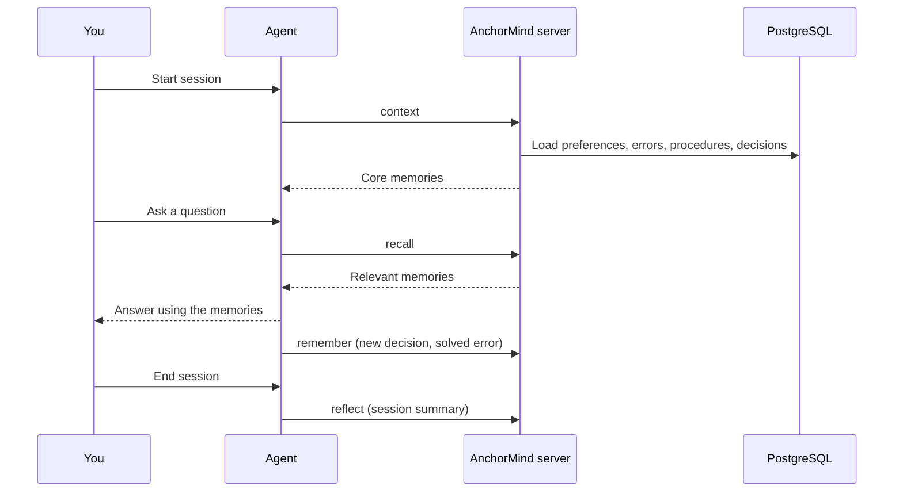

<p align="center">
  
</p>

<p align="center">
  <a href="https://github.com/JinHo-von-Choi/anchormind/releases">
    
  </a>
  <a href="https://github.com/JinHo-von-Choi/anchormind/stargazers">
    
  </a>
  <a href="LICENSE">
    
  </a>
  <a href="https://lobehub.com/mcp/jinho-von-choi-memento-mcp">
    
  </a>
</p>

<p align="center">
  <a href="README.md">한국어</a>
</p>

# AnchorMind

[What is it](#what-is-it) | [How does it work](#how-does-it-work) | [How do I install it](#how-do-i-install-it) | [FAQ](#faq)

## What is it

AnchorMind is an MCP server that gives AI agents, including Claude Code, Cursor, Codex and others, long-term memory across sessions. It stores data in PostgreSQL. You host it yourself.

Agents forget the conversation when a session ends, so you end up explaining the project setup, yesterday's bug fix and your preferred workflow again. That gets old fast. AnchorMind saves those details as short units, called fragments, and returns only the relevant ones in the next session.

### When to use it

- You use AI agents every day and keep repeating the same explanations.
- You want Claude Code, Cursor, Codex and other agents to share the same memory across several machines.
- You want separate memory for each project or client.
- You want memory on your own server and database.

## How does it work

1. Run the AnchorMind server.
2. Register it as an MCP server in your agent.
3. At the start of a session, the agent fetches core memories from the server. As the conversation continues, it searches when it needs context and saves anything worth keeping.
4. The agent uses those memories in its answer.

Example:

```
[Session 1]
You:   Our project uses PostgreSQL 15 and runs tests with Vitest.
Agent: (calls remember, stores 2 fragments)

[Next day, new session]
Agent: (calls context at start, receives the 2 stored fragments)
You:   How do I run the tests again?
Agent: (calls recall) This project uses Vitest. Run it with npx vitest.
```

You do not have to repeat the same explanation every session. Here is the full sequence:



The agent makes the tool calls. The server does not start them on its own, so use hooks or an instruction file to make those calls reliable ([make the agent use memory automatically](#how-do-i-make-the-agent-use-the-memory-tools-on-its-own)).

## How do I install it

### Install the server

You need: Node.js 22+, and Docker (not needed if you already have PostgreSQL with pgvector).

**1. Database** (skip if you already have one)

```bash
docker run -d --name anchormind-db -p 5432:5432 \
  -e POSTGRES_PASSWORD=change-me -e POSTGRES_DB=memento \
  -v anchormind-pgdata:/var/lib/postgresql/data pgvector/pgvector:pg15

docker exec anchormind-db psql -U postgres -d memento \
  -c "CREATE EXTENSION IF NOT EXISTS vector"
```

**2. Server**

```bash
git clone https://github.com/JinHo-von-Choi/anchormind.git
cd anchormind
npm install

cp .env.example.minimal .env
```

Open `.env` and do two things.

- Change `MEMENTO_ACCESS_KEY` to something other than `change-me`. It is the master key and is used as the `Authorization: Bearer` token.
- Append the three lines below. They enable local embeddings so natural-language search works without an external API key.

```
EMBEDDING_PROVIDER=transformers
EMBEDDING_MODEL=Xenova/multilingual-e5-small
EMBEDDING_DIMENSIONS=384
```

The database settings already match the `docker run` values above, so leave them. Then run:

```bash
npm run migrate
node scripts/post-migrate-flexible-embedding-dims.js
node server.js
```

The first start downloads the embedding model (about 120 MB).

**3. Check**

```bash
curl http://localhost:57332/health
```

You should see `{"status":"healthy", ...}`. To store and fetch one memory, follow [First Memory Flow](docs/getting-started/first-memory-flow.md).

More:

- Interactive script that builds `.env` by asking questions, and using an external embedding API: [INSTALL.en.md](docs/INSTALL.en.md)
- Delegating the installation to an AI assistant: [INSTALL.en.md](docs/INSTALL.en.md#delegate-to-an-ai-assistant)
- Always-on Docker: [Production Docker](docs/operations/production-docker.md)
- Windows: [WSL2 guide](docs/getting-started/windows-wsl2.md)
- When you get stuck: [Troubleshooting](docs/getting-started/troubleshooting.md)

### Connect an agent

Claude Code:

```bash
claude mcp add anchormind http://localhost:57332/mcp \
  --transport http \
  --scope user \
  --header "Authorization: Bearer YOUR_ACCESS_KEY"
```

`claude mcp list` should show `Connected`. Claude Code does not recognize HTTP MCP servers written by hand into `settings.json`, so use this command or `.mcp.json`.

Other clients (Cursor, Codex, Windsurf, Claude.ai Web, ChatGPT and more) are covered in [Connecting Clients](docs/getting-started/clients.en.md).

To make the agent use the memory tools on its own after connecting, see the [FAQ below](#how-do-i-make-the-agent-use-the-memory-tools-on-its-own).

## FAQ

Each question has one answer. If you do not find what you need, check [Troubleshooting](docs/getting-started/troubleshooting.md) or the [issues](https://github.com/JinHo-von-Choi/anchormind/issues).

### Is this the right tool

#### How is this different from file-based memory such as CLAUDE.md or MEMORY.md?

File memory is read in full. As it grows, it costs more tokens, and old entries can start to conflict with newer ones. AnchorMind searches instead and returns only the relevant fragments within a `tokenBudget`.

#### How is this different from RAG?

RAG works from existing documents. It indexes them and finds the matching ones for you, while AnchorMind is memory the agent writes and reads during conversation. The server also cleans up what gets stored, including duplicate merging, contradiction detection, and importance decay.

#### Can I use it as a knowledge base?

Yes. Store facts as fragments of one or two sentences, and `recall` can return them later. It is not designed to index long documents as whole files.

#### Can I use it together with another memory tool I already have?

Yes. AnchorMind is an MCP server, so you can register it in the same agent. The server name is prefixed to the tool name, which keeps tools separate, for example `mcp__anchormind__recall`.

#### How do I decide whether to switch from the tool I use?

Use this test. If any one of these applies, AnchorMind is worth trying; if none does, your current tool is probably enough.

- The data must stay on your own server.
- Several agents and machines need the same memory.
- You want the server to clean up duplicates and contradictions.

#### When is it not a good fit?

- If what you need to remember fits on one `CLAUDE.md` page, a file is simpler.
- You must operate PostgreSQL (pgvector).
- Search is tuned for fact-sized units. Questions that require synthesizing long reasoning are weaker ([Benchmark](#benchmark)).

### Installation and requirements

#### Do I need an embedding model or an OpenAI key?

Not strictly. PostgreSQL alone handles storage, keyword recall, links, and the admin features, but natural-language questions (`text` queries) return zero results without embeddings. That is why the install steps above enable local embeddings.

#### Should embeddings come from a local model or an external API?

- Local model: set `EMBEDDING_PROVIDER=transformers` in `.env`. No API key is needed, and the text stays on your machine.
- External API: use an embedding API key such as OpenAI.

Do not mix them. One database has to use one method because the vector dimensions are different. Details: [Local embedding guide](docs/embedding-local.md).

#### Do I need Redis?

No. Redis only adds the search cache and session activity tracking.

#### What changes if I run without Redis?

Keyword search is immediate. A newly stored fragment can take up to 5 minutes to appear in natural-language search, because the server builds embeddings every 5 minutes.

#### How much memory do the local models use?

| Model | Extra memory | Used for |
|-------|--------------|----------|
| Local embedding (`multilingual-e5-small`) | about 150 MB | natural-language search |
| NLI for contradiction detection (mDeBERTa) | about 250 to 280 MB | judging whether a new fragment contradicts an existing one |

Together, they add about 0.4 GB to the server process. The reranker is off by default, and with an external embedding API, the local embedding share is not used. Per-configuration figures: [Requirements](docs/Requirements.md).

#### Can I keep the NLI model from using memory?

Yes, if you run NLI as a separate service with `NLI_SERVICE_URL`; that keeps it out of the server process. `MEMENTO_CONSOLIDATE_DETECT_CONTRADICT=false` only disables contradiction detection, so the model still loads when the server starts.

### Connecting agents

#### How do I make the agent use the memory tools on its own?

Two options. You can use both.

1. Hooks or the plugin: call `context` when a session starts, then run a retrospective automatically when it ends. `anchormind init --target claude --write` creates the Claude Code plugin ([Plugin install](docs/getting-started/plugins.en.md), [Hooks](docs/getting-started/hooks.en.md)).
2. Instructions: after you connect MCP, ask the agent to read the guide from the `get_skill_guide` tool and set itself up to use the memory tools actively. The server includes that guide.

#### What if a memory conflicts with a rule in CLAUDE.md?

Injected memories sit below the system prompt and instruction files. Facts work well, such as "we use PostgreSQL 15"; behavior rules, such as "write tests in Given-When-Then," may be ignored if they conflict. Put behavior rules in `CLAUDE.md`, `AGENTS.md`, hooks, or skills.

### Data and security

#### Where is my memory stored?

In the PostgreSQL you operate.

#### Does memory ever leave my machine?

Only through paths you configure.

- If you use an external embedding API, the text you store is sent to that API. Local embeddings send nothing.
- LLM features, including quality evaluation and automatic reflect, need an LLM provider. The default is `gemini-cli`, and you can [change the provider](docs/operations/llm-providers.md).
- A per-key and per-workspace `egress_policy` limits external LLM providers, masks outgoing text, and records transmissions ([Security and Operations Checklist](docs/operations/hardening.en.md)).

#### Can I store passwords or tokens?

Not recommended. Sensitive patterns are masked on save, but some formats may be missed. Keep secrets in environment variables or a secret store, and save only their location in memory.

### Memory quality

#### Can wrong content be kept out of memory?

Not completely. People also drift a little each time they recall something. So the design does not try to prevent it entirely; it keeps the damage from spreading and makes it findable and fixable. The four items below explain how.

#### How do I fix wrong memory?

Memory is stored per fragment, so you fix only the wrong fragment with `amend` or remove it with `forget`. One summary cannot be wrong as a whole.

#### What happens when new content contradicts existing content?

The server detects the contradiction and expires the old fragment (anchors are exempt). Nothing is deleted; history stays through `valid_to` and `superseded_by`. The steps are in [Internals](docs/internals.en.md#contradiction-detection-pipeline).

#### How do I mark content I am not sure about?

Store it as `assertionStatus=inferred`. Change it to `verified` once confirmed, or `rejected` if it was wrong.

#### Does it catch content that was stored wrongly from the start?

No. The server only catches contradictions when a conflicting fragment arrives. Keep important memories as anchors and check them yourself. Low-trust fragments, such as content from external documents, are left out of the ANCHOR and CORE injected at session start, and text that tries to override the agent's instructions goes to a review queue.

#### What happens as memory keeps growing?

Duplicate merging, contradiction detection, importance decay and TTL expiry run periodically. Fragments that stop being used move to lower tiers and eventually disappear. Mark a fragment as an anchor to exempt it from decay and expiry; setting an anchor requires the `anchor` permission.

### Troubleshooting

#### I stored something but recall does not return it

- If it shows `pending_review: true` it is in the review queue ([Troubleshooting #17](docs/getting-started/troubleshooting.md)).
- A different workspace is invisible. Use the same `workspace` for saving and reading.
- If only natural-language queries come back empty, check that embeddings are on. Without Redis, a newly stored fragment can take up to 5 minutes to show up in natural-language search. Keyword search is immediate.

Other symptoms are in [Troubleshooting](docs/getting-started/troubleshooting.md), which has 17 entries.

#### I remember this being called memento-mcp

Same project. It was renamed to AnchorMind because many projects have the same or similar names. Both `anchormind` and `memento-mcp` work as commands, and some environment variables keep the `MEMENTO_` prefix.
## Fragment types

Memory is stored in short fragments, usually one or two sentences. Each one has one of 7 types.

| Type | Content |
|------|---------|
| `fact` | Facts such as settings, paths, versions |
| `decision` | Technical choices and their rationale |
| `error` | Errors that occurred, their cause and fix |
| `preference` | The user's style and way of working |
| `procedure` | Repeatable steps such as deploy, build, test |
| `relation` | Relations and dependencies between entities |
| `episode` | Narrative with before and after (1000 chars; the rest 300) |

The main tools are `context` for restoring core memory at session start, `recall` for search, `remember` for saving fragments, and `reflect` for saving a session-end summary. Short version: these four cover the normal flow. All tools and usage rules: [SKILL.md](SKILL.md). Full feature list: [Capabilities](docs/capabilities.en.md).

## Benchmark

[LongMemEval-S](https://arxiv.org/abs/2410.10813), 500 questions (measured 2026-10-10, reader deepseek-flash, judges GPT-4o official setting, MiniMax and Claude Sonnet 5.5):

| Metric | Score | Condition |
|-|-|-|
| All evidence turns within top-10 | 91.2% | bge-m3, segment search on |
| Retrieval recall_any@5 | 98.4% | session level |
| QA accuracy (GPT-4o official judge) | 84.0% | 95% CI 80.5-87.0% |
| QA accuracy (MiniMax judge) | 84.0% | 95% CI 80.5-87.0% |
| QA accuracy (Claude judge) | 78.0% | 95% CI 74.2-81.4% |

Retrieval finds most of the evidence. The remaining errors concentrate in questions that need summing values across sessions or computing dates (multi-session, temporal-reasoning). Conditions and analysis: [Benchmark Report](docs/benchmark.en.md).

## Documentation

| I want to | Document |
|-----------|----------|
| Install and verify | [Requirements](docs/Requirements.md), [Quick Start](docs/getting-started/quickstart.md), [First Memory Flow](docs/getting-started/first-memory-flow.md), [INSTALL.en.md](docs/INSTALL.en.md) |
| Connect a client | [Connecting Clients](docs/getting-started/clients.en.md), [Claude Code](docs/getting-started/claude-code.md), [Plugins](docs/getting-started/plugins.en.md), [Hooks](docs/getting-started/hooks.en.md) |
| Fix a problem | [Troubleshooting](docs/getting-started/troubleshooting.md) |
| Upgrade | [Upgrade Notes](docs/operations/upgrade-notes.en.md) |
| Operate | [Security and Operations Checklist](docs/operations/hardening.en.md), [Backup and restore](docs/operations/backup-restore.md), [Monitoring](docs/operations/monitoring.md), [Admin console](docs/admin-console-guide.md) |
| Look up settings | [Configuration](docs/configuration.en.md) |
| See every feature | [Capabilities](docs/capabilities.en.md), [Features](docs/features.md) |
| Interfaces | [API Reference](docs/api-reference.en.md), [CLI](docs/cli.en.md), [SKILL.md](SKILL.md) |
| Internals | [Architecture](docs/architecture.en.md), [Internals](docs/internals.en.md) |
| Change history | [CHANGELOG](CHANGELOG.md) |

## License

Apache 2.0

---

<p align="center">
  Made by <a href="mailto:jinho.von.choi@nerdvana.kr">Jinho Choi</a> &nbsp;|&nbsp;
  <a href="https://buymeacoffee.com/jinho.von.choi">Buy me a coffee</a>
</p>
