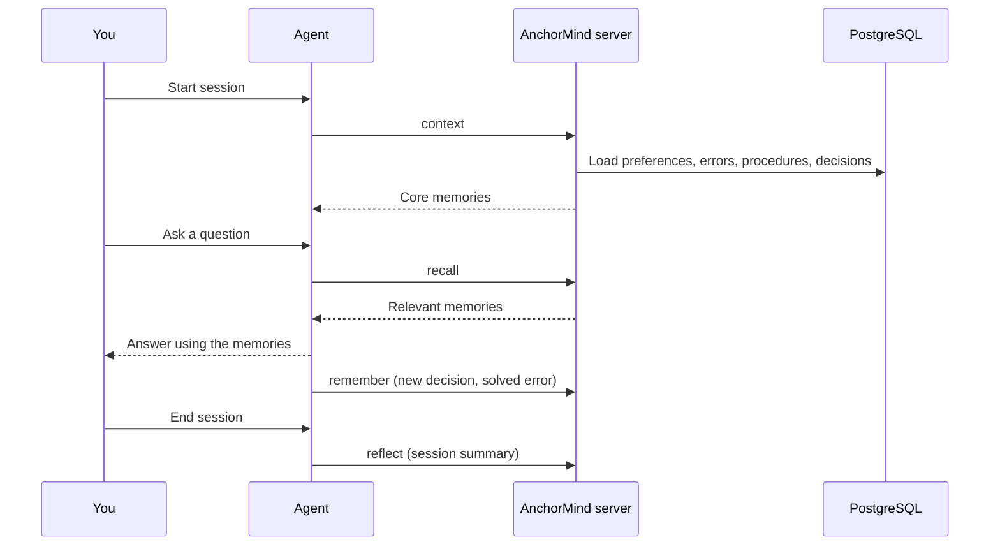

<p align="center">
  
</p>

<p align="center">
  <a href="https://github.com/JinHo-von-Choi/anchormind/releases">
    
  </a>
  <a href="https://github.com/JinHo-von-Choi/anchormind/stargazers">
    
  </a>
  <a href="LICENSE">
    
  </a>
  <a href="https://lobehub.com/mcp/jinho-von-choi-memento-mcp">
    
  </a>
</p>

<p align="center">
  <a href="README.md">한국어</a>
</p>

# AnchorMind

[What is it](#what-is-it) | [How does it work](#how-does-it-work) | [How do I install it](#how-do-i-install-it) | [FAQ](#faq)

## What is it

An MCP server that gives AI agents (Claude Code, Cursor, Codex and others) long-term memory that survives the end of a session. You host it yourself and it stores data in PostgreSQL.

An agent forgets the conversation when a session ends. You have to explain the project setup, yesterday's bug fix and your preferred way of working again each time. AnchorMind stores these as short units (fragments) and returns only the relevant ones in the next session.

## How does it work

1. Run the AnchorMind server.
2. Register it as an MCP server in your agent.
3. When a session starts, the agent fetches core memories from the server. During the conversation it searches when needed and saves what is worth keeping.
4. The agent answers using those memories.

What you see:

```
[Session 1]
You:   Our project uses PostgreSQL 15 and runs tests with Vitest.
Agent: (calls remember, stores 2 fragments)

[Next day, new session]
Agent: (calls context at start, receives the 2 stored fragments)
You:   How do I run the tests again?
Agent: (calls recall) This project uses Vitest. Run it with npx vitest.
```

You do not repeat the same explanation every session. The full sequence:



The agent makes the tool calls. The server never initiates anything. To make the agent call them reliably, set up hooks or an instruction file ([make the agent use memory automatically](#how-do-i-make-the-agent-use-the-memory-tools-on-its-own)).

## How do I install it

### Install the server

You need: Node.js 20+, and Docker (not needed if you already have PostgreSQL with pgvector).

**1. Database** (skip if you already have one)

```bash
docker run -d --name anchormind-db -p 5432:5432 \
  -e POSTGRES_PASSWORD=change-me -e POSTGRES_DB=memento \
  -v anchormind-pgdata:/var/lib/postgresql/data pgvector/pgvector:pg15

docker exec anchormind-db psql -U postgres -d memento \
  -c "CREATE EXTENSION IF NOT EXISTS vector"
```

**2. Server**

```bash
git clone https://github.com/JinHo-von-Choi/anchormind.git
cd anchormind
npm install

cp .env.example.minimal .env
```

Open `.env` and do two things.

- Change `MEMENTO_ACCESS_KEY` to something other than `change-me`. It is the master key and is used as the `Authorization: Bearer` token.
- Append the three lines below. They enable local embeddings so natural-language search works without an external API key.

```
EMBEDDING_PROVIDER=transformers
EMBEDDING_MODEL=Xenova/multilingual-e5-small
EMBEDDING_DIMENSIONS=384
```

The database settings already match the `docker run` values above, so leave them. Then run:

```bash
npm run migrate
node scripts/post-migrate-flexible-embedding-dims.js
node server.js
```

The first start downloads the embedding model (about 120 MB).

**3. Check**

```bash
curl http://localhost:57332/health
```

You should see `{"status":"healthy", ...}`. To store and fetch one memory, follow [First Memory Flow](docs/getting-started/first-memory-flow.md).

More:

- Interactive script that builds `.env` by asking questions, and using an external embedding API: [INSTALL.en.md](docs/INSTALL.en.md)
- Delegating the installation to an AI assistant: [INSTALL.en.md](docs/INSTALL.en.md#delegate-to-an-ai-assistant)
- Always-on Docker: [Production Docker](docs/operations/production-docker.md)
- Windows: [WSL2 guide](docs/getting-started/windows-wsl2.md)
- When you get stuck: [Troubleshooting](docs/getting-started/troubleshooting.md)

### Connect an agent

Claude Code:

```bash
claude mcp add anchormind http://localhost:57332/mcp \
  --transport http \
  --scope user \
  --header "Authorization: Bearer YOUR_ACCESS_KEY"
```

`claude mcp list` should show `Connected`. Claude Code does not recognize HTTP MCP servers written by hand into `settings.json`, so use this command or `.mcp.json`.

Other clients (Cursor, Codex, Windsurf, Claude.ai Web, ChatGPT and more) are covered in [Connecting Clients](docs/getting-started/clients.en.md).

To make the agent use the memory tools on its own after connecting, see the [FAQ below](#how-do-i-make-the-agent-use-the-memory-tools-on-its-own).

## FAQ

### How is this different from file-based memory such as CLAUDE.md or MEMORY.md?

File memory has to be read in full every session. The more it grows, the more tokens it costs, and old and new entries start to contradict each other. AnchorMind searches and returns only the relevant fragments within a `tokenBudget`, and keeps memory tidy through duplicate merging, contradiction detection, importance decay and TTL expiry. Several agents and machines can share one server, and `workspace` separates memory per project.

### When is it not a good fit?

- If what you need to remember fits on one `CLAUDE.md` page, a file is simpler.
- You must operate PostgreSQL (pgvector).
- Search is tuned for fact-sized units. Questions that require synthesizing long reasoning are weaker ([Benchmark](#benchmark)).

### Do I need an embedding model or an OpenAI key?

Not strictly. PostgreSQL alone gives you storage, keyword recall, links and the admin features.

Without embeddings, though, natural-language questions (`text` queries) return zero results. That is why the install steps above turn on local embeddings.

- Local model: `EMBEDDING_PROVIDER=transformers` in `.env`. No API key is needed and the text never leaves your machine.
- External API: an embedding API key such as OpenAI.

You cannot switch and mix embedding methods inside one database because the vector dimensions differ. Details: [Local embedding guide](docs/embedding-local.md).

### Do I need Redis?

Optional. Adding it enables the search cache and session activity tracking. Without Redis, a newly stored fragment can take up to 5 minutes to show up in natural-language search (the server builds embeddings every 5 minutes).

### Where is my memory stored, and does it leave my machine?

It is stored in the PostgreSQL you operate. Data leaves only along paths you configure. With an external embedding API, the text you store is sent to that API; use local embeddings to avoid that. If you connect an external LLM for quality evaluation and automatic reflect, restrict providers per key and workspace with `egress_policy`, which also masks outgoing text ([Security and Operations Checklist](docs/operations/hardening.en.md)).

### Can I store passwords or tokens?

Not recommended. Sensitive patterns are masked when saving, but not every format is caught. Keep secrets in environment variables or a secret store and record only their location in memory.

### How do I make the agent use the memory tools on its own?

Two ways, and you can combine them.

1. Hooks or the plugin: call `context` at session start and run a retrospective at session end automatically. `anchormind init --target claude --write` builds the Claude Code plugin ([Plugin install](docs/getting-started/plugins.en.md), [Hooks](docs/getting-started/hooks.en.md)).
2. Instructions: after connecting MCP, ask the agent to read the guide from the `get_skill_guide` tool and configure itself to use the memory tools actively. The server provides the guide.

### What if a memory conflicts with a rule in CLAUDE.md?

Injected memories rank below the system prompt and instruction files. A fact like "we use PostgreSQL 15" works well, but a behavior rule like "write tests in Given-When-Then" can be ignored when it conflicts. Put behavior rules in `CLAUDE.md`, `AGENTS.md`, hooks or skills.

### I stored something but recall does not return it

- If it shows `pending_review: true` it is in the review queue ([Troubleshooting #17](docs/getting-started/troubleshooting.md)).
- A different workspace is invisible. Use the same `workspace` for saving and reading.
- If only natural-language queries come back empty, check that embeddings are on. Without Redis, a newly stored fragment can take up to 5 minutes to show up in natural-language search. Keyword search is immediate.

Other symptoms are in [Troubleshooting](docs/getting-started/troubleshooting.md), which has 17 entries.

### What happens as memory keeps growing?

Duplicate merging, contradiction detection, importance decay and TTL expiry run periodically. Fragments that stop being used move to lower tiers and eventually disappear. Mark a fragment as an anchor to exempt it from decay and expiry; setting an anchor requires the `anchor` permission.

### I remember this being called memento-mcp

Same project. It was renamed to AnchorMind because many projects have the same or similar names. Both `anchormind` and `memento-mcp` work as commands, and some environment variables keep the `MEMENTO_` prefix.

## Fragment types

Memory is stored as fragments of one or two sentences. Each fragment is one of 7 types.

| Type | Content |
|------|---------|
| `fact` | Facts such as settings, paths, versions |
| `decision` | Technical choices and their rationale |
| `error` | Errors that occurred, their cause and fix |
| `preference` | The user's style and way of working |
| `procedure` | Repeatable steps such as deploy, build, test |
| `relation` | Relations and dependencies between entities |
| `episode` | Narrative with before and after (1000 chars; the rest 300) |

The main tools are `context` (restore core memory at session start), `recall` (search), `remember` (save) and `reflect` (save a summary at session end). All tools and usage rules: [SKILL.md](SKILL.md). Full feature list: [Capabilities](docs/capabilities.en.md).

## Benchmark

[LongMemEval-S](https://arxiv.org/abs/2410.10813), 500 questions (measured 2026-03-29, reader and judge Gemini 2.5 Flash):

| Metric | Score |
|-|-|
| Retrieval recall_any@5 | 88.3% (text-embedding-3-small) |
| QA accuracy | 44.9% |

Retrieval finds the fragments, but accuracy drops at the step that synthesizes an answer from them (multi-session and temporal reasoning). Conditions and analysis: [Benchmark Report](docs/benchmark.en.md).

## Documentation

| I want to | Document |
|-----------|----------|
| Install and verify | [Requirements](docs/Requirements.md), [Quick Start](docs/getting-started/quickstart.md), [First Memory Flow](docs/getting-started/first-memory-flow.md), [INSTALL.en.md](docs/INSTALL.en.md) |
| Connect a client | [Connecting Clients](docs/getting-started/clients.en.md), [Claude Code](docs/getting-started/claude-code.md), [Plugins](docs/getting-started/plugins.en.md), [Hooks](docs/getting-started/hooks.en.md) |
| Fix a problem | [Troubleshooting](docs/getting-started/troubleshooting.md) |
| Upgrade | [Upgrade Notes](docs/operations/upgrade-notes.en.md) |
| Operate | [Security and Operations Checklist](docs/operations/hardening.en.md), [Backup and restore](docs/operations/backup-restore.md), [Monitoring](docs/operations/monitoring.md), [Admin console](docs/admin-console-guide.md) |
| Look up settings | [Configuration](docs/configuration.en.md) |
| See every feature | [Capabilities](docs/capabilities.en.md), [Features](docs/features.md) |
| Interfaces | [API Reference](docs/api-reference.en.md), [CLI](docs/cli.en.md), [SKILL.md](SKILL.md) |
| Internals | [Architecture](docs/architecture.en.md), [Internals](docs/internals.en.md) |
| Change history | [CHANGELOG](CHANGELOG.md) |

## License

Apache 2.0

---

<p align="center">
  Made by <a href="mailto:jinho.von.choi@nerdvana.kr">Jinho Choi</a> &nbsp;|&nbsp;
  <a href="https://buymeacoffee.com/jinho.von.choi">Buy me a coffee</a>
</p>
