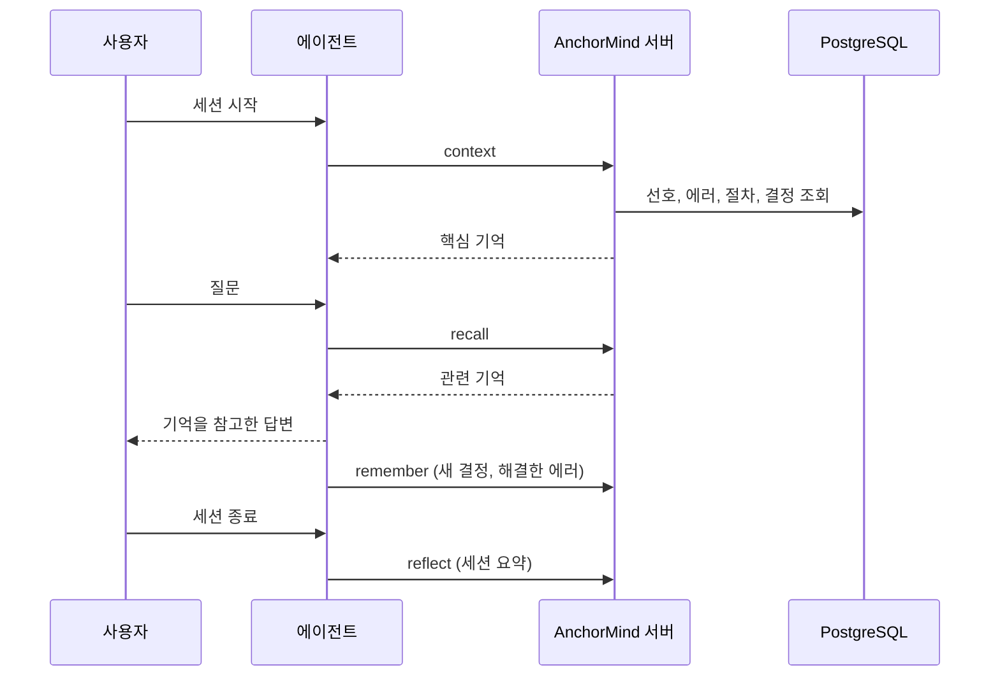

<p align="center">
  
</p>

<p align="center">
  <a href="https://github.com/JinHo-von-Choi/anchormind/releases">
    
  </a>
  <a href="https://github.com/JinHo-von-Choi/anchormind/stargazers">
    
  </a>
  <a href="LICENSE">
    
  </a>
  <a href="https://lobehub.com/mcp/jinho-von-choi-memento-mcp">
    
  </a>
</p>

<p align="center">
  <a href="README.en.md">English</a>
</p>

# AnchorMind

[이게 뭔데](#이게-뭔데) | [어떻게 돌아가는데](#어떻게-돌아가는데) | [어떻게 설치하는데](#어떻게-설치하는데) | [자주 묻는 질문](#자주-묻는-질문)

## 이게 뭔데

AI 에이전트(Claude Code, Cursor, Codex 등)에 세션이 끝나도 남아 있는 장기 기억을 붙여 주는 MCP 서버다. 직접 호스팅하고, 기억은 PostgreSQL에 저장한다.

에이전트는 세션이 끝나면 대화를 잊는다. 프로젝트 설정, 어제 해결한 버그, 선호하는 작업 방식을 매번 다시 설명해야 한다. AnchorMind는 이런 내용을 짧은 단위(파편)로 저장해 두고, 다음 세션에서 필요한 것만 꺼내 준다.

## 어떻게 돌아가는데

1. AnchorMind 서버를 실행한다.
2. 에이전트에 MCP 서버로 등록한다.
3. 세션을 시작하면 에이전트가 서버에서 핵심 기억을 받아 온다. 대화 중에는 필요할 때 검색하고, 남겨야 할 내용은 저장한다.
4. 에이전트가 그 기억을 참고해 답한다.

사용자 눈에는 대략 이렇게 보인다.

```
[세션 1]
사용자: 우리 프로젝트는 PostgreSQL 15를 쓰고 테스트는 Vitest로 돌려.
에이전트: (remember 호출, 파편 2개 저장)

[다음 날, 새 세션]
에이전트: (시작하며 context 호출, 저장해 둔 파편 2개를 받음)
사용자: 테스트 어떻게 돌리더라?
에이전트: (recall 호출) 이 프로젝트는 Vitest를 쓴다. npx vitest로 실행하면 된다.
```

세션이 바뀔 때마다 같은 설명을 반복할 필요가 없다. 전체 흐름은 아래 다이어그램과 같다.



도구 호출은 에이전트가 한다. 서버가 먼저 말을 걸지는 않는다. 에이전트가 빼먹지 않고 호출하게 하려면 훅이나 지침 파일을 설정해야 한다([자동으로 쓰게 하려면](#에이전트가-기억-도구를-알아서-쓰게-하려면)).

## 어떻게 설치하는데

### 서버 설치

필요한 것: Node.js 20+, Docker. pgvector가 설치된 PostgreSQL이 이미 있다면 Docker는 없어도 된다.

**1. 데이터베이스** (이미 있으면 건너뛴다)

```bash
docker run -d --name anchormind-db -p 5432:5432 \
  -e POSTGRES_PASSWORD=change-me -e POSTGRES_DB=memento \
  -v anchormind-pgdata:/var/lib/postgresql/data pgvector/pgvector:pg15

docker exec anchormind-db psql -U postgres -d memento \
  -c "CREATE EXTENSION IF NOT EXISTS vector"
```

**2. 서버**

```bash
git clone https://github.com/JinHo-von-Choi/anchormind.git
cd anchormind
npm install

cp .env.example.minimal .env
```

`.env`를 열고 두 가지만 한다.

- `MEMENTO_ACCESS_KEY`를 `change-me`가 아닌 값으로 바꾼다. 이 값은 마스터 키이고, `Authorization: Bearer` 토큰으로 쓰인다.
- 아래 세 줄을 추가한다. 외부 API 키 없이 자연어 검색을 쓰기 위한 로컬 임베딩 설정이다.

```
EMBEDDING_PROVIDER=transformers
EMBEDDING_MODEL=Xenova/multilingual-e5-small
EMBEDDING_DIMENSIONS=384
```

DB 설정은 위 `docker run` 값과 이미 맞아 있으므로 그대로 둔다. 그다음 실행한다.

```bash
npm run migrate
node scripts/post-migrate-flexible-embedding-dims.js
node server.js
```

처음 켤 때 임베딩 모델을 내려받는다. 약 120MB다.

**3. 확인**

```bash
curl http://localhost:57332/health
```

`{"status":"healthy", ...}`가 나오면 정상이다. 저장과 조회까지 한 번 확인하려면 [First Memory Flow](docs/getting-started/first-memory-flow.md)를 따라 한다.

더 필요한 경우:

- 질문에 답하면서 `.env` 만들기, 외부 임베딩 API 쓰기: [INSTALL.md](docs/INSTALL.md)
- 설치를 AI 어시스턴트에게 맡기기: [INSTALL.md](docs/INSTALL.md#ai에게-맡기기)
- Docker로 계속 운영하기: [Production Docker](docs/operations/production-docker.md)
- Windows: [WSL2 가이드](docs/getting-started/windows-wsl2.md)
- 막혔을 때: [문제 해결](docs/getting-started/troubleshooting.md)

### 에이전트에 연결

Claude Code:

```bash
claude mcp add anchormind http://localhost:57332/mcp \
  --transport http \
  --scope user \
  --header "Authorization: Bearer YOUR_ACCESS_KEY"
```

`claude mcp list`에서 `Connected`가 보이면 연결된 것이다. Claude Code는 `settings.json`에 직접 적은 HTTP MCP 서버를 인식하지 않으므로, 이 명령이나 `.mcp.json`을 써야 한다.

Cursor, Codex, Windsurf, Claude.ai Web, ChatGPT 등 다른 클라이언트는 [클라이언트별 연결](docs/getting-started/clients.md)에 정리되어 있다.

연결한 뒤 에이전트가 기억 도구를 알아서 쓰게 하는 방법은 [아래 FAQ](#에이전트가-기억-도구를-알아서-쓰게-하려면)에 있다.

## 자주 묻는 질문

### CLAUDE.md나 MEMORY.md 같은 파일 메모와 무엇이 다른가?

파일 메모는 세션마다 전체를 읽혀야 한다. 내용이 늘수록 토큰이 늘고 오래된 내용과 새 내용이 충돌한다. AnchorMind는 필요한 파편만 `tokenBudget` 안에서 검색해 돌려주고, 중복 병합, 모순 탐지, 중요도 감쇠, TTL 만료로 기억을 정리한다. 여러 에이전트와 기기가 같은 서버를 공유할 수 있고, `workspace`로 프로젝트별 기억을 나눈다.

### 어떤 경우에 맞지 않나?

- 기억할 내용이 `CLAUDE.md` 한 장에 들어갈 정도면 파일이 더 간단하다.
- PostgreSQL(pgvector)을 운영해야 한다.
- 검색은 사실 단위에 맞춰져 있다. 긴 추론을 합성하는 질문은 약하다([벤치마크](#벤치마크)).

### 임베딩 모델이나 OpenAI 키가 꼭 필요한가?

필수는 아니다. PostgreSQL만 있으면 저장, 키워드 회상, 링크, 관리 기능이 동작한다.

다만 임베딩이 없으면 자연어 질문(`text` 질의)은 결과가 0건이다. 그래서 위 설치 절차에 로컬 임베딩을 넣었다.

- 로컬 모델: `.env`에 `EMBEDDING_PROVIDER=transformers`. API 키가 필요 없고 본문이 밖으로 나가지 않는다.
- 외부 API: OpenAI 같은 임베딩 API 키.

임베딩 방식은 한 DB 안에서 바꿔 섞을 수 없다. 벡터 차원이 달라지기 때문이다. 상세는 [로컬 임베딩 가이드](docs/embedding-local.md).

### Redis가 필요한가?

선택이다. 붙이면 검색 캐시와 세션 활동 추적이 켜진다. Redis 없이 쓰면 새로 저장한 파편이 자연어 검색에 잡히기까지 최대 5분이 걸린다(서버가 5분 주기로 임베딩을 만든다).

### 내 기억은 어디에 저장되고 밖으로 나가나?

내가 운영하는 PostgreSQL에 저장된다. 밖으로 나가는 경로는 설정한 것뿐이다. 외부 임베딩 API를 쓰면 저장하는 본문이 그 API로 전송된다. 막으려면 로컬 임베딩을 쓴다. 품질 평가와 자동 reflect에 외부 LLM을 연결했다면 키와 workspace별 `egress_policy`로 제공자를 제한하고 전송 본문을 마스킹한다([보안과 운영 점검](docs/operations/hardening.md)).

### 비밀번호나 토큰을 기억시켜도 되나?

권하지 않는다. 저장할 때 민감 정보 패턴을 가려서 저장하지만 모든 형식을 잡지는 못한다. 비밀값은 환경 변수나 비밀 저장소에 두고, 기억에는 위치만 적는다.

### 에이전트가 기억 도구를 알아서 쓰게 하려면?

방법은 두 가지다. 같이 써도 된다.

1. 훅 또는 플러그인: 세션 시작에 `context` 호출, 세션 종료에 회고를 자동으로 건다. `anchormind init --target claude --write`로 Claude Code 플러그인을 만든다([플러그인 설치](docs/getting-started/plugins.md), [훅 설정](docs/getting-started/hooks.md)).
2. 지침: MCP 연결 뒤 에이전트에게 `get_skill_guide` 도구의 가이드를 읽고 기억 도구를 적극적으로 쓰도록 설정해 달라고 요청한다. 가이드는 서버가 내려준다.

### 기억이 CLAUDE.md의 규칙과 충돌하면?

주입된 기억은 시스템 프롬프트와 지침 파일보다 우선순위가 낮다. "PostgreSQL 15를 쓴다" 같은 사실은 잘 작동하지만, "테스트는 Given-When-Then으로 쓴다" 같은 행동 규칙은 충돌하면 무시될 수 있다. 행동 규칙은 `CLAUDE.md`, `AGENTS.md`, 훅, 스킬에 둔다.

### 저장했는데 recall에 안 나온다

- `pending_review: true`로 나오면 검토 대기 상태다([문제 해결 17번](docs/getting-started/troubleshooting.md#17-remember한-파편이-recall에-보이지-않거나-pending_review로-나옴)).
- workspace가 다르면 보이지 않는다. 저장과 조회에 같은 `workspace`를 쓴다.
- 자연어 질의만 비면 임베딩이 켜져 있는지 확인한다. Redis 없이 쓰면 저장 직후 최대 5분은 자연어 검색에 잡히지 않는다. 키워드 검색은 바로 된다.

그 밖의 증상은 [문제 해결](docs/getting-started/troubleshooting.md)에 17개 항목이 있다.

### 기억이 계속 쌓이면?

중복 병합, 모순 탐지, 중요도 감쇠, TTL 만료가 주기적으로 돈다. 오래 쓰이지 않은 파편은 낮은 계층으로 내려가고 결국 사라진다. 남겨야 하는 파편은 앵커로 지정하면 감쇠와 만료에서 빠진다. 앵커 지정에는 `anchor` 권한이 필요하다.

### 이름이 memento-mcp였던 것 같은데?

같은 프로젝트다. 같거나 비슷한 이름의 프로젝트가 많아 AnchorMind로 바꿨다. 명령어는 `anchormind`와 `memento-mcp` 둘 다 쓸 수 있고, 일부 환경 변수는 `MEMENTO_` 접두사를 유지한다.

## 기억의 단위

기억은 한두 문장짜리 파편으로 저장된다. 파편은 7가지 유형 중 하나다.

| 유형 | 내용 |
|------|------|
| `fact` | 설정값, 경로, 버전 같은 사실 |
| `decision` | 기술 선택과 그 근거 |
| `error` | 발생한 에러와 원인, 해결 방법 |
| `preference` | 사용자의 스타일과 작업 방식 |
| `procedure` | 배포, 빌드, 테스트 같은 반복 절차 |
| `relation` | 엔티티 간 관계와 의존성 |
| `episode` | 전후관계가 있는 서사(1000자, 나머지는 300자) |

주요 도구는 `context`(세션 시작 시 핵심 기억 복원), `recall`(검색), `remember`(저장), `reflect`(세션 종료 시 요약 저장)다. 전체 도구와 사용 규칙은 [SKILL.md](SKILL.md), 기능 전체 목록은 [기능 상세](docs/capabilities.md)에 있다.

## 벤치마크

[LongMemEval-S](https://arxiv.org/abs/2410.10813) 500문항 기준(2026-03-29 측정, 리더와 평가자 Gemini 2.5 Flash):

| 지표 | 점수 |
|-|-|
| 검색 recall_any@5 | 88.3% (text-embedding-3-small) |
| QA 정답률 | 44.9% |

검색은 찾아 오지만, 찾은 파편에서 답을 합성하는 단계(여러 세션에 걸친 추론, 시간축 추론)에서 정답률이 떨어진다. 측정 조건과 분석은 [Benchmark Report](docs/benchmark.md).

## 문서

| 할 일 | 문서 |
|-------------|------|
| 처음 설치하고 검증 | [시스템 요구사항](docs/Requirements.md), [Quick Start](docs/getting-started/quickstart.md), [First Memory Flow](docs/getting-started/first-memory-flow.md), [INSTALL.md](docs/INSTALL.md) |
| 클라이언트 연결 | [클라이언트별 연결](docs/getting-started/clients.md), [Claude Code](docs/getting-started/claude-code.md), [플러그인](docs/getting-started/plugins.md), [훅](docs/getting-started/hooks.md) |
| 문제 해결 | [Troubleshooting](docs/getting-started/troubleshooting.md) |
| 업데이트 | [업그레이드 노트](docs/operations/upgrade-notes.md) |
| 운영 | [보안과 운영 점검](docs/operations/hardening.md), [백업과 복구](docs/operations/backup-restore.md), [모니터링](docs/operations/monitoring.md), [관리자 콘솔](docs/admin-console-guide.md) |
| 설정값 | [Configuration](docs/configuration.md) |
| 전체 기능 | [기능 상세](docs/capabilities.md), [Features](docs/features.md) |
| 인터페이스 | [API Reference](docs/api-reference.md), [CLI](docs/cli.md), [SKILL.md](SKILL.md) |
| 내부 구조 | [Architecture](docs/architecture.md), [Internals](docs/internals.md) |
| 변경 이력 | [CHANGELOG](CHANGELOG.md) |

## License

Apache 2.0

---

<p align="center">
  Made by <a href="mailto:jinho.von.choi@nerdvana.kr">Jinho Choi</a> &nbsp;|&nbsp;
  <a href="https://buymeacoffee.com/jinho.von.choi">Buy me a coffee</a>
</p>
