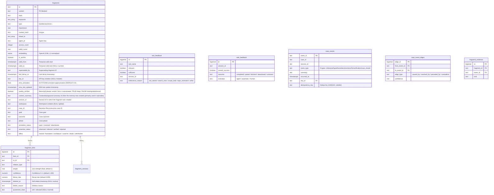

# Architecture

## System Architecture



```
server.js  (HTTP server)
    |
    +-- POST /mcp          Streamable HTTP -- JSON-RPC receiver
    +-- GET  /mcp          Streamable HTTP -- SSE stream
    +-- DELETE /mcp        Streamable HTTP -- Session termination
    +-- GET  /sse          Legacy SSE -- Session creation
    +-- POST /message      Legacy SSE -- JSON-RPC receiver
    +-- GET  /health, /health/live, /health/ready  Health checks (live: process liveness, ready: primary DB response)
    +-- GET  /metrics      Prometheus metrics
    +-- GET|POST /authorize  OAuth 2.0 authorization endpoint
    +-- POST /token        OAuth 2.0 token endpoint
    +-- POST /register     OAuth 2.0 dynamic client registration
    +-- POST /session/rotate  Session ID rotation
    +-- GET  /openapi.json OpenAPI document
    +-- /v1/internal/model/nothing/*  Admin console
    +-- GET  /.well-known/oauth-authorization-server
    +-- GET  /.well-known/oauth-protected-resource
    |
    +-- lib/jsonrpc.js        JSON-RPC 2.0 parsing and method dispatch. `dispatchJsonRpc` uses a METHOD_MAP object for static method-name-to-handler routing
    +-- lib/tool-registry.js  Registration and routing for 20 tools (16 for every key, 4 master-only: memory_stats, memory_consolidate, check_update, apply_update)
    |
    +-- lib/memory/
            +-- MemoryManager.js          Business logic orchestration facade (singleton). Routes public methods to 4 processors via delegation. Shared properties synchronized via _installSharedSync
            +-- processors/               remember/recall/reflect/link domain processors
            |   +-- MemoryRememberer.js   Dedicated remember(). The dryRun, atomic and non-atomic branches all pass the semantic write gate (WriteGate) at the same point, declaring related variables before use to avoid TDZ (Temporal Dead Zone) reference errors
            |   +-- MemoryRecaller.js     Dedicated recall(). fields pick step, depth filter, CBR path
            |   +-- MemoryReflector.js    Dedicated reflect(). session summary->fragment conversion
            |   +-- MemoryLinker.js       Dedicated link()/forget()/amend()
            |   +-- ReflectProcessor.js   Dedicated reflect() logic. summary->fragment conversion, episode creation, Working Memory cleanup
            |   +-- AutoReflect.js        Session-end auto reflect orchestrator
            |   +-- EpisodeContinuityService.js Inserts case_events milestone_reached + preceded_by edge after reflect() (idempotency_key-based dedup)
            |   +-- SessionActivityTracker.js Per-session tool call/fragment activity tracking (Redis)
            |   +-- RememberDuplicate.js  Detects and classifies remember duplicate hits (`same_scope`, `other_workspace`, `closed`, `unknown`), adds `duplicate_of` for same-scope hits and builds the existing-fragment status response when `MEMENTO_REMEMBER_DUPLICATE_GUARD` is on
            +-- read/                     Search layer modules
            |   +-- FragmentSearch.js     3-layer search orchestration (structural: L1->L2, semantic: L1->L2||L3 RRF merge). `_executeSearch` decomposes into `_buildTextRRF` (L2+L3 parallel RRF when text parameter present) / `_buildFallbackCombined` (L1+L2 only when no text)
            |   +-- FragmentReader.js     Fragment reads. `getById(id, agentId, keyId, groupKeyIds)` -- groupKeyIds parameter enables single-call lookup of fragments belonging to same-group keys. `getByIds`, `getHistory`, `searchByKeywords`, `searchBySemantic`, `findCaseIdBySessionTopic`, `findErrorFragmentsBySessionTopic`
            |   +-- ContextBuilder.js     Dedicated context() logic. Reserves effective-workspace anchor slots first, deduplicates candidates by ID in anchor > core > learning > working order, guarantees anchors plus minimum non-anchor slots, and uses one token-selected set for flat/structured/injectionText outputs
            |   +-- ContextLines.js       context injection line renderer (pure functions). Headers and the `- ` line prefix are fixed; with `MEMENTO_CONTEXT_ANNOTATE=on` memory lines end with ` (YYYY-MM-DD, assertion)`
            |   +-- AnswerPack.js         recall `format:"pack"` answer pack v0 renderer (pure functions). Fixed policy paragraph, `<<<MEMORY ...>>>` delimiter blocks, content escaping and 1000 character cap, UTC dates, caseId/topic groups
            |   +-- AnswerPackLoader.js   Answer pack source and supersession chain (superseded_by links) lookup with the same agent, key and workspace predicates as recall. Adds `origin` and `trust_tier` to default recall responses (`MEMENTO_PROVENANCE`)
            |   +-- ProvenanceLoader.js   Provenance column lookup (source, origin, trust_tier) by fragment id and the recall scope predicate. Shared by the pack, recall responses and the context core filter. The caller passes the pool
            |   +-- ContextTrust.js       Anchor SQL fragment, core candidate filter with its result meta and annotation origin field for the context injection exclusion (trust tier 1 or lower; for core also fragments whose tier could not be confirmed) (pure functions)
            |   +-- ReviewVisibility.js   Visibility predicates for pending and rejected review fragments (independent of the switch). SQL fragments for recall queries (visible to the writing key only), id lookups (API key lookups only), injection candidates, anchor promotion and contradiction resolution (always excluded), response markers (pending_review, low_trust, review_rejected) and the core candidate filter
            |   +-- SearchLayerScope.js   Common scope options FragmentSearch passes to its layers (workspace, agent, anchor filter, review visibility viewer)
            |   +-- provenance-metrics.js Core trust exclusion metric `memento_context_core_trust_excluded_total{reason}`
            |   +-- GraphNeighborSearch.js L2.5 graph neighbor search (fragment_links 1-hop bidirectional UNION, tanh-saturated scoring + relation-type boosts)
            |   +-- HistoryReconstructor.js case_id/entity-based narrative reconstruction (ordered_timeline, causal_chains, unresolved_branches)
            |   +-- BudgetSelector.js     recall token budget selection (`MEMENTO_RANK_BEFORE_BUDGET`). Pure functions for the search-order cut (`trimInSearchOrder`) and the final-score selection (`selectWithinBudget`)
            |   +-- Reranker.js           Cross-Encoder reranking (disabled by default; enable via MEMENTO_RERANKER_ENABLED or RERANKER_URL)
            |   +-- CaseRecall.js         Dedicated caseMode: true path. Returns (goal, events[], outcome) triple per case_id
            |   +-- LinkedFragmentLoader.js Bulk linked fragment load (1-hop neighbor batch query)
            |   +-- RecallSuggestionEngine.js Analyzes recall results and generates _suggestion meta field
            |   +-- assistant-query.js    Assistant-side query helper
            |   +-- SearchScope.js        Search coherence filter contract. Encapsulates workspace/caseId/resolutionStatus/phase/affect/type/topic/isAnchor/keyId. applyTo(fragment) -> boolean. L1 HotCache, L2, L3, and Graph prefilters are backed by a final common filter in search()
            |   +-- SearchSideEffects.js  Search side-effect isolation module. commitSearchSideEffects() synchronously returns searchEventId; fire-and-forgets SearchParamAdaptor.recordOutcome()
            +-- write/                    Write layer modules
            |   +-- WriteGate.js          Single semantic write gate. Applies the normalize, sensitive, length, policy, workspace and anchor steps in order and records violations as warnings or rejects them on hard-gate keys. `MEMENTO_WRITE_GATE`
            |   +-- ReviewQueue.js        Synchronous review queue decisions (pure functions). Collects instruction override phrases, anchors, preferences and procedures with trust tier 1 or lower and unauthorized anchor warnings as reasons, and stores review_state='pending' according to the key's review mode (off, flagged, all). Holds anchor requests until approval. INSERT column fragment and update SET fragment. `MEMENTO_REVIEW_QUEUE`
            |   +-- reviewRules.js        Instruction override phrase rule table (Korean, English). The table of ordinary procedural sentences that must not match is in the tests
            |   +-- write-gate-metrics.js Gate verdict metric `memento_write_gate_total{entry,outcome}`
            |   +-- gateApproval.js       Gate approval marks. FragmentWriter semantic methods accept only write values registered by WriteGate
            |   +-- serverWriteGate.js    Builds the gate for server write paths, injecting the key's allowed workspace set and hard gate setting from ApiKeyStore
            |   +-- FragmentImporter.js   Passes import rows through the gate and writes them with FragmentWriter. Applies the target key profile (owner, restore) (shared by admin import and CLI import)
            |   +-- DedupScope.js         content_hash duplicate detection scope (`MEMENTO_DEDUP_SCOPE`). Reads the valid detection indexes to choose the detection scope, ON CONFLICT target, pre-insert lookup and batch fold key
            |   +-- ForgetCascade.js      forget deletion cascade (`MEMENTO_FORGET_CASCADE`). Lock statement, deletion and case_events summary statement, receipt (`purged`), orphan summary cleanup
            |   +-- FragmentWriter.js     Fragment writes. The semantic methods (insert, update) accept only gated values; internal metadata goes through updateInternal, which cannot write the 9 semantic columns (also delete, incrementAccess, touchLinked)
            |   +-- rowLock.js            Id-ordered lock statement (`fragmentRowLock`) and locked-row delete statement shared by multi-row fragment writes
            |   +-- FragmentFactory.js    Fragment creation, validation, PII masking entry point (`maskSensitiveText`, rules come from the `lib/security` table) and per-type truncation (`limitContentLength`)
            |   +-- affect.js             Allowed affect tag values and `sanitizeAffect` normalization (shared by FragmentFactory and FragmentWriter)
            |   +-- FragmentStore.js      PostgreSQL CRUD facade (delegates to FragmentReader + FragmentWriter)
            |   +-- RememberPostProcessor.js remember() post-processing pipeline (embedding/morpheme/linking/assertion/temporal linking/evaluation queue/ProactiveRecall)
            |   +-- ConflictResolver.js   Conflict detection, supersede, autoLinkOnRemember (topic-based structural linking)
            |   +-- IdempotencyStore.js   Retry response records for write tools that create no fragment (`amend`, `tool_feedback`) (`idempotency_records`)
            |   +-- BatchRememberProcessor.js Dedicated batchRemember() logic. Phase A (validation and per-item gate) -> B (INSERT) -> C (post-processing) 3-stage. Supports async opt-in via `async: true` parameter: after pre-validation, enqueues job to Redis (`memento:batch_remember_queue`) and returns immediately. Falls back to synchronous path when Redis is unavailable. Worker (BatchRememberWorker) consumes the queue via the existing INSERT path
            |   +-- BatchRememberWorker.js Async queue worker for batch_remember. Polls `memento:batch_remember_queue` Redis queue and processes jobs via the BatchRememberProcessor synchronous path. `getBatchRememberWorker()` singleton factory. Because it is `PollingWorker`-based it registers in the worker registry at startup and `gracefulShutdown` drains it together with the other workers
            +-- transfer/                 Export and import modules
            |   +-- exportFormat.js       Column lists of JSONL format versions 2 and 1, line classification, version negotiation, header and end lines (pure functions)
            |   +-- FragmentExporter.js   Builds fragment, link and history lines in id ordered batches (shared by the admin API and the CLI)
            |   +-- importRecords.js      Adapts text lines and JSON bodies to one record stream
            |   +-- ImportRunner.js       Imports a record stream. Maps file ids to stored ids to connect links and history; dryRun rolls one transaction back
            |   +-- ImportReport.js       Counts: imported, duplicates, rejected (typed reasons), errors
            |   +-- importErrors.js       Import option and abort error types
            |   +-- importRuntime.js      Builds the gate, writer, link store and profile (server gate for the admin API, default gate for the CLI)
            +-- link/                     Link layer modules
            |   +-- ReconsolidationEngine.js Dynamic fragment_links weight/confidence update engine (reinforce/decay/quarantine/restore/soft_delete + history recording)
            |   +-- GraphLinker.js        Embedding-ready event subscriber for auto-linking + retroactive linking + Hebbian co-retrieval linking
            |   +-- LinkStore.js          Fragment link management (fragment_links CRUD + RCA chains)
            |   +-- SessionLinker.js      Session fragment consolidation, auto-linking, cycle detection
            |   +-- TemporalLinker.js     Time-based auto-linking (same topic +-24h, weight=max(0.3, 1-hours/24), max 5 links)
            |   +-- AuditProvenance.js    Key cap of contradiction audit fragments (the lower tier of the two source fragments, 1 when it cannot be confirmed)
            |   +-- ContradictionDetector.js Contradiction detection, supersede relation detection, pending queue processing
            +-- consolidate/              Consolidation/GC layer modules
            |   +-- MemoryConsolidator.js 22-stage declarative maintenance pipeline (stageDefs array, TOTAL_STAGES = stageDefs.length). NLI + Gemini hybrid
            |   +-- ConsolidatorGC.js     Feedback reports, stale fragment collection/cleanup, long fragment splitting, feedback-based correction
            |   +-- FragmentGC.js         Fragment expiration/deletion, exponential decay, TTL tier transitions (permanent parole + EMA batch decay)
            |   +-- idOrderedUpdate.js    Locks and updates decay and utility score changes in id-ascending batches (`MEMENTO_SCORE_UPDATE_BATCH`). Rows below the minimum change (`MEMENTO_DECAY_MIN_DELTA`, `MEMENTO_UTILITY_MIN_DELTA`) are not rewritten
            |   +-- resumableBackfill.js  Resumable backfill helper (`runResumableBackfill`). Records a watermark per batch so a run with the same job name resumes, and records row-level errors in `backfill_failures`
            |   +-- decay.js              Exponential decay half-life constants, pure computation functions, ACT-R EMA activation approximation (`updateEmaActivation`, `computeEmaRankBoost`), EMA-based dynamic half-life (`computeDynamicHalfLife`), age-weighted utility score (`computeUtilityScore`)
            |   +-- UtilityBaseline.js    Fragment utility baseline computation (dedup/compression decision baseline)
            |   +-- feedbackFactor.js     Feedback-based correction factor computation
            |   +-- split-gate.js         Long-fragment split gate conditions
            |   +-- split-metrics.js      Split-result metric aggregation
            +-- embedding/                Embedding layer modules
            |   +-- EmbeddingWorker.js    Redis queue-based async embedding worker (EventEmitter)
            |   +-- EmbeddingCache.js     Query embedding Redis cache (emb:q:{sha256 first 16 chars} key, 1-hour TTL, fault-isolated)
            |   +-- MorphemeIndex.js      Morpheme-based L3 fallback index
            |   +-- MorphemeTokenizer.js  Local CPU morpheme analyzer. Splits Unicode script runs then routes per language: Korean garu-ko (filterHangulMorphemes strips particles/endings/single-syllable tokens), English natural PorterStemmer, Chinese @node-rs/jieba, Japanese kuromoji (skipped when enableKuromoji=false). MorphemeIndex.tokenize() delegates to it, replacing the LLM subprocess on the default path (MEMENTO_MORPHEME_TOKENIZER=local). Benchmark: 1.06ms/call, resident RSS +28.9MB.
            +-- signals/                  Signal layer modules
            |   +-- SpreadingActivation.js Async activation propagation based on contextText (ACT-R model, keywords GIN seed -> 1-hop graph spread, 10-min TTL cache)
            |   +-- CaseRewardBackprop.js  case verification event -> evidence fragment importance atomic backpropagation. Returns immediately when MEMENTO_CASE_BACKPROP_ENABLED is unset
            |   +-- NLIClassifier.js      NLI-based contradiction classifier (mDeBERTa ONNX, CPU)
            |   +-- MemoryEvaluator.js    Async Gemini CLI quality evaluation worker (singleton)
            |   +-- SearchMetrics.js      L1/L2/L3/total layer-level latency collection (Redis circular buffer, P50/P90/P99)
            |   +-- SearchEventAnalyzer.js Search event analysis, query pattern tracking (reads from SearchEventRecorder)
            |   +-- SearchEventRecorder.js FragmentSearch.search() result to search_events table recording
            |   +-- RecallEvalSet.js      Search evaluation set (`tests/fixtures/recall-eval-v2`) format, validation and loading
            |   +-- RecallMetrics.js      Pure functions for search evaluation metrics such as R@k, MRR and nDCG within the token budget
            |   +-- RecallRankStats.js    Pure rank-based metric functions (shared with RecallBenchmark)
            |   +-- PairedBootstrap.js    Paired bootstrap confidence interval over per-query differences of two runs (seeded)
            |   +-- EvaluationMetrics.js  tool_feedback-based implicit Precision@5 and downstream task success rate computation
            |   +-- SearchParamAdaptor.js key_id x query_type x hour minSimilarity online learning, atomic UPSERT
            +-- QuotaChecker.js           API key fragment quota check (fragment_limit based)
            +-- FragmentIndex.js          Redis L1 index management, getFragmentIndex() singleton factory. Chooses the working memory store between Redis and the PostgreSQL fallback
            +-- WorkingMemoryRows.js      Reads, cleanup and per-key cap of the working memory rows (`source=wm-fallback`) used while Redis is not ready (`MEMENTO_WM_PG_FALLBACK`, `MEMENTO_WM_FALLBACK_MAX_ROWS`)
            +-- WorkingMemorySql.js       Working memory row marker and the SQL condition that excludes those rows from queries and counts
            +-- provenance.js             Fragment provenance and trust tier decisions (pure functions). Accepted origins, per-origin tiers, key cap (3 with the `trusted_origin` permission or the master key, otherwise 2), the injection exclusion predicate that reads NULL as 2 and the SQL fragment with the same threshold, observed client notation, INSERT column fragment
            +-- reviewState.js            Review states (pending, approved, rejected), review modes (off, flagged, all) and the review mode markers of key permission lists (review_off, review_all)
            +-- keyScope.js               `keyScopeClause(params, column, { keyId, groupKeyIds })` shared helper. Generates key_id-scoped WHERE clauses. Used by FragmentReader.getById / findCaseIdBySessionTopic / findErrorFragmentsBySessionTopic / GraphLinker / LinkStore / HistoryReconstructor / reconstruct.js
            +-- CaseEventStore.js         Semantic milestone log (case_events CRUD, DAG edges, evidence join)
            +-- memory-schema.sql         PostgreSQL schema definition
            +-- migrations/               52 DB migration SQL files (migration-001 through migration-054; 046 and 053 are unused), applied sequentially against the schema_migrations table. Used by `scripts/migrate.js` and `scripts/lint-migrations.js`
```

Supporting modules:

```
lib/
+-- config.js          Environment variables exposed as constants. Includes AUTH_DISABLED (MEMENTO_AUTH_DISABLED), OAUTH_TOKEN_TTL_SECONDS, OAUTH_REFRESH_TTL_SECONDS, ENABLE_OPENAPI, SSE_HEARTBEAT_INTERVAL_MS
+-- auth.js            Bearer token validation. `validateAuthentication(req, msg)` -- actual entry point. When `MEMENTO_ACCESS_KEY` is unset it defers to `buildAuthDecision` and rejects unless `MEMENTO_AUTH_DISABLED=true` (the server already refuses to start in that configuration). `resolveAuthConfig(accessKey, authDisabled)` -- pure function for auth config resolution. `buildAuthDecision(accessKey, authDisabled, bearerToken)` -- pure function for unit testing (excludes OAuth/DB API key verification)
+-- oauth.js           OAuth 2.0 PKCE authorization/token handling
+-- sessions.js        Streamable/Legacy SSE session lifecycle
+-- redis.js           ioredis client (Sentinel support)
+-- safe-compare.js    Timing-safe string comparison (`safeCompare`: SHA-256 hash then `timingSafeEqual`). Leaf module shared by auth.js and oauth.js
+-- session-id.js      Distinguishes how an MCP session ID was received (header, query) and whether it has the server-issued format (UUID). Handling is set by `MEMENTO_SESSION_ID_POLICY`
+-- protocol-versions.js Supported MCP protocol version list and default version. Leaf module shared by config.js and metrics.js
+-- process-guards.js  `installProcessGuards` (records unhandledRejection and uncaughtException, handles the fatal path once) and `createShutdownGuard` (runs shutdown once with the `MEMENTO_SHUTDOWN_DEADLINE_MS` cap)
+-- session-audit.js   Session event audit log (`session-audit.log`, NDJSON). Records only the first 16 chars of the sha256 hash of the sessionId
+-- gemini.js          Google Gemini API/CLI client (geminiCLIJson, isGeminiCLIAvailable)
+-- compression.js     Response compression (gzip/deflate)
+-- metrics.js         Prometheus metric collection (prom-client). 4 denial-path counters: `memento_auth_denied_total{reason}` (auth denial), `memento_cors_denied_total{reason}` (CORS denial), `memento_rbac_denied_total{tool,reason}` (RBAC denial), `memento_tenant_isolation_blocked_total{component}` (tenant isolation block)
+-- logger.js          Winston logger (daily rotate). REDACT_PATTERNS-based redactor format: auto-masking with the log entries of the `lib/security/sensitivePatterns.js` table (Authorization Bearer tokens, mmcp_ API keys, mmcp_session cookies, OAuth code/refresh_token/access_token, shared token rules). content field trimmed to head 50 + tail 50 when exceeding 200 chars
+-- openapi.js         OpenAPI 3.1.0 spec generator. Enabled when `ENABLE_OPENAPI=true` via `GET /openapi.json`. Auth-level-based tool list filtering: master key -> all paths (including Admin REST API), API key -> permissions-based tool list
+-- rate-limiter.js    IP-based sliding window rate limiter
+-- rbac.js            RBAC authorization (read/write/admin tool-level permissions)
+-- env-parse.js       Raw value classification of boolean and enum environment variables. Leaf module that lets config.js and the switch ledger (`config/switches.js`) share one rule
+-- security/          Sensitive data detection. `sensitivePatterns.js` (the rule table shared by the storage path and the logger, a leaf module with no imports) and `SensitiveScanner.js` (pure functions that mask content fields and keywords and report rule names)
+-- http-handlers.js   HTTP handler re-export hub. Actual implementations in lib/handlers/ submodules
+-- scheduler.js       Periodic task scheduler (setInterval task management)
+-- scheduler-registry.js Scheduler task registry (per-task success/failure tracking)
+-- utils.js           Origin validation, JSON body parsing (2MB cap), SSE output

lib/handlers/
+-- _common.js         applyCorsOrigin, setWorkerRefs, recordConsolidateRun (shared utilities)
+-- health-handler.js  handleHealth, handleLive, handleReady, handleMetrics
+-- session-handler.js POST /session/rotate (calls rotateSession; per-IP per-minute cap in `_rotate-ratelimit.js`)
+-- _ratelimit-cache.js QuotaChecker.getUsage delegating wrapper for X-RateLimit-* headers
+-- _rotate-ratelimit.js IP-based rate limit dedicated to /session/rotate (`MEMENTO_ROTATE_RATE_LIMIT_PER_MIN`)
+-- mcp-handler.js     handleMcpPost/Get/Delete (Streamable HTTP). handleMcpPost internally decomposes into 4 private functions: `_resolveExistingSession` / `_createInitializeSession` / `_validateProtocolVersion` / `_dispatchAndRespond`. `injectSessionContext(msg, ctx)` -- injects server-controlled context (_sessionId, _keyId, _groupKeyIds, _permissions, _defaultWorkspace) into tools/call message arguments. Client-supplied fields of the same name are overwritten with server values to prevent forgery
+-- sse-handler.js     handleLegacySseGet/Post (Legacy SSE)
+-- oauth-handler.js   OAuth 5 endpoints (ServerMetadata, ResourceMetadata, Register, Authorize, Token)

lib/admin/
+-- ApiKeyStore.js     API key CRUD, group CRUD, authentication verification (SHA-256 hash storage, raw key returned once only). `getGroupKeyIds(keyId)` -- returns array of all key IDs in keyId's group (null input returns null immediately, no DB query)
+-- OAuthClientStore.js OAuth client CRUD (client_id/secret validation, redirect_uri whitelist)
+-- admin-routes.js    Admin HTTP dispatcher (routes UI, images, static files, REST API)
+-- admin-auth.js      Admin auth routes (POST /auth, session cookie issuance)
+-- admin-login-guard.js Admin auth failure accumulation and per-account delay (delay applies only when `MEMENTO_ADMIN_AUTH_BACKOFF=on`)
+-- key-state-cache.js API key state recheck cache used when a session is used (`MEMENTO_SESSION_KEY_RECHECK_MS`)
+-- admin-metrics.js   `/metrics-summary` summary (reads the prom-client registry directly, 10-second response cache)
+-- admin-keys.js      API key management routes
+-- key-policy.js      Validation of key policy column edits (default_mode, allowed_workspaces, symbolic_hard_gate) and the audit record format
+-- admin-review.js    Review queue routes (GET /review, POST /review/:id/approve, /reject) and request validation
+-- ReviewStore.js     Pending review list, approval and rejection (row lock, decision record, idempotency key) and automatic rejection after 30 undecided days (every 6 hours)
+-- admin-memory.js    Memory operations routes (overview, fragments, anomalies, graph)
+-- admin-sessions.js  Session management routes
+-- admin-logs.js      Log viewing routes
+-- admin-export.js    Fragment export/import routes (export, import)

assets/admin/
+-- index.html         Admin SPA app shell (login form + container)
+-- admin.css          Admin UI stylesheet
+-- admin.js           Admin UI logic (8 navigation sections: overview, API keys, groups, memory ops, sessions, logs, knowledge graph, metrics)
+-- vendor/            Copies of the Tailwind CSS 3.4.17 and d3 7.9.0 scripts. The console response CSP is `script-src 'self' 'unsafe-inline'` and allows no external script host. Source and sha256 are in `PROVENANCE.md`

lib/http/
+-- helpers.js         HTTP SSE stream helpers and request parsing utilities

lib/logging/
+-- audit.js           Audit logging and access history recording
+-- session-ref.js     Session ID notation used in logs and external prompts (first 8 chars)

lib/outbox/
+-- Outbox.js          Transactional outbox writes. `enqueue(client, event)` accepts only a connection after BEGIN, `enqueueStandalone(pool, event)` writes in a short separate transaction. `MEMENTO_OUTBOX`
+-- OutboxHandlers.js  Per-topic handler registry (consumer extension point), `OutboxPermanentError`
+-- OutboxStore.js     outbox_events claim (FOR UPDATE SKIP LOCKED with a lease), complete, fail, release, retention cleanup and stats queries
+-- OutboxWorker.js    Polling worker. Runs handlers in claim order, exponential retries and dead-letter, lease budget, cleanup and gauge updates. `MEMENTO_OUTBOX_WORKER`
+-- outbox-metrics.js  `memento_outbox_*` metrics
```

Storage access is handled by `getPrimaryPool` and `queryWithAgentVector` in `lib/tools/db.js`.

Tool implementations are separated into `lib/tools/`.

```
lib/tools/
+-- memory.js    16 MCP tool handlers
+-- reconstruct.js  reconstruct_history, search_traces tool handlers (Narrative Reconstruction)
+-- memory-schemas.js  Tool schema definitions (inputSchema)
+-- tool-head.js  name, title and MCP hints (`readOnlyHint`, `destructiveHint`, `idempotentHint`, `openWorldHint`) of every tool
+-- recall-response-params.js recall response shape parameters (`fields`, `format`) schema fragments
+-- origin-param.js `origin` parameter schema fragment of remember and batch_remember items
+-- context-response.js context tool response assembly. Moves the internal fields (`_anchorSelection`, `_coreSelection` and so on) into `_meta`
+-- tool-error.js Converts error text in tool responses. Intended business errors pass through, driver/OS/runtime errors become fixed text, and storage CHECK constraint violations become an `INVALID_ARGUMENT` message naming the parameter and allowed values
+-- db.js        PostgreSQL connection pool, agent session variable query helper (not exposed via MCP). getPrimaryPool(), getBatchPool(), queryWithAgentVector(). With `opts.lock` it runs the lock statement first in the same transaction and then the write statement with the locked ids as $1
+-- lock-retry.js Re-runs transactions that ended in a deadlock (40P01) or lock timeout (55P03) (`MEMENTO_DB_LOCK_RETRY_MAX`), and the `memento_db_deadlock_retries_total` and `memento_db_write_failures_total` metrics
+-- embedding.js OpenAI text embedding generation
+-- stats.js     Access statistics collection and storage
+-- pool-gate.js Caps background use of the primary pool
+-- serverTime.js Server time helper
+-- update-tools.js check_update / apply_update definitions and handlers (master key only)
+-- prompts.js   MCP Prompts definitions (analyze-session, retrieve-relevant-memory, etc.)
+-- resources.js MCP Resources definitions (memory://stats, memory://topics, etc.)
+-- index.js     Tool handler exports
```

CLI entry point and subcommands are separated into `bin/` and `lib/cli/`.

```
bin/
+-- memento.js          CLI entry point

lib/cli/
+-- parseArgs.js        Argument parser
+-- serve.js            Server start
+-- migrate.js          Migration
+-- cleanup.js          Noise cleanup
+-- backfill.js         Embedding backfill
+-- stats.js            Statistics query
+-- health.js           Connection diagnostics
+-- recall.js           Terminal recall
+-- remember.js         Terminal remember
+-- inspect.js          Fragment detail
+-- benchmark.js        Goldset recall measurement (Recall@k, MRR, latency)
+-- anchor-scope.js     Non-default anchor scope inventory, approved shared-anchor normalization, snapshot backfill (dry-run by default)
+-- session.js          Session listing, cleanup, rotation
+-- export.js           Fragment JSONL backup
+-- import.js           Fragment JSONL restore
+-- update.js           New version check and apply
+-- completion.js       Shell completion
+-- _mcpClient.js       Remote MCP client
+-- _format.js          Output formatter
+-- _stdin.js           Standard input reader
```

One-time utility scripts are in `scripts/`.

```
scripts/
+-- backfill-embeddings.js                       Embedding backfill (one-time)
+-- normalize-vectors.js                         Vector L2 normalization (one-time)
+-- migrate.js                                   DB migration runner (schema_migrations-based incremental, .env auto-load, pgvector schema auto-detection)
+-- post-migrate-flexible-embedding-dims.js      Embedding dimension migration
+-- cleanup-noise.js                             Bulk cleanup of low-quality/noise fragments (one-time)
+-- purge-oauth-clients.js                       Removes old dynamically registered OAuth clients that were never used (preview by default, `--execute` deletes)
+-- purge-orphan-case-summaries.js               Replaces case_events summaries whose source fragment no longer exists with `[삭제됨]` (target from `--url` or PG variables, preview by default, `--execute --i-have-a-backup` changes)
+-- lint-migrations.js                           Migration file convention check (`npm run lint:migrations`)
+-- lint-ratchet.js                              Compares silent catch handlers, complexity, file length and direct environment reads against `scripts/lint-baseline.json` (`npm run lint:ratchet`)
+-- import-cycles.js                             Import cycle check over relative imports in `lib`, `config` and `server.js` (static-only and static+dynamic results printed separately)
+-- check-coverage.js                            Compares unit test coverage totals with `coverage-baseline.json` (`npm run test:coverage`)
+-- switch-report.mjs                            Prints the applied value, default and state of every feature switch as a table (`npm run switches`, `--strict`)
+-- measure/recall-metrics.mjs                   Measures search metrics on the evaluation set and compares two runs (`--compare`)
+-- measure/protocol-era-probe.mjs               Sends modern MCP requests to a scratch server and observes the era decision and initialize fallback
+-- measure/context-annotation-tokens.mjs        Measures the token growth of context injection line annotations and the answer pack offline (no database)
+-- ops/backup.sh                                agent_memory schema backup with manifest (14 days kept by default)
+-- ops/restore-verify.mjs                       Restores a dump into a disposable test server and compares it with the manifest
+-- ops/online-index.mjs                         Builds large table indexes from the work list (`ops/index-manifest.json`) with `CONCURRENTLY`
+-- ops/finish-dedup-scope.mjs                   Drops the per-key content_hash indexes to finish the duplicate detection scope switch
+-- release.js                                   Release procedure (`npm run release -- X.Y.Z`)
```

`config/switches.js` is the feature switch ledger. It holds the name, documented default, purpose and category of each switch and computes the value that applies in a given environment with the same rules as the code that reads it. `npm run switches`, `switches` in the admin `/stats` response and the `[Startup] switches:` startup log line use this ledger.

`config/recommended-settings.js` returns the names of recommended production settings that are not applied (`recommendedSettingsGap`), and the server lists them on one `[Startup] Recommended settings not applied:` line at startup. Values are not included.

`config/memory.js` is a separate configuration file for the memory system. It holds time-semantic composite ranking weights, stale thresholds, embedding worker settings, context injection, pagination, and GC policies. `config/validate-memory-config.js` is called once at server startup to runtime-validate MEMORY_CONFIG weight sums, ranges, and type constraints. The process is halted on failure.

---

## MemoryManager Facade Decomposition

MemoryManager is a thin facade. Business logic is separated into 4 processors under `lib/memory/processors/`.

```
MemoryManager (facade)
  +-- MemoryRememberer  -- remember(), batchRemember()
  +-- MemoryRecaller    -- recall(), context()
  +-- MemoryReflector   -- reflect()
  +-- MemoryLinker      -- link(), forget(), amend()
```

Dependency direction: processors -> shared modules (FragmentStore, FragmentSearch, etc.) / external callers -> facade -> processors.

### _installSharedSync Design

The facade constructor initializes 17 shared objects (store, index, factory, search, quotaChecker, etc.) then DI-injects them into 4 processors. It then calls `_installSharedSync()` to wrap each shared property setter in the facade with `Object.defineProperty`.

```js
// Conceptual code
Object.defineProperty(this, 'store', {
  set(v) { this._store = v; for (const p of this._processors) p.store = v; }
});
```

A single `mm.store = stubStore` test mock replacement propagates automatically to the facade and all processors. Test isolation and production DI both use the same code path.

---

## Idempotency (migration-034-v2.16.0-bundle)

The `fragments` table has an `idempotency_key TEXT NULL` column with 2 partial UNIQUE indexes.

| Index | Condition | Purpose |
|-------|-----------|---------|
| `uq_frag_idem_tenant` | `idempotency_key IS NOT NULL AND key_id IS NOT NULL` | Uniqueness within API key tenant |
| `uq_frag_idem_master` | `idempotency_key IS NOT NULL AND key_id IS NULL` | Uniqueness within master tenant |

When `remember()` is called with `params.idempotencyKey`, `FragmentReader.findByIdempotencyKey(key, keyId)` looks up the existing fragment. If found, the existing id is returned without creating a new fragment, and `idempotent: true` is included in the response. If not found, the fragment is stored normally and the `idempotency_key` column is recorded.

---

## Rate Limit Headers

`QuotaChecker.getUsage(keyId)` queries the fragment usage count per API key. Results are cached in a module-level in-memory Map with 10-second TTL to block repeated DB queries (upper limit: 1,000 entries).

HTTP response header injection point: immediately before the `sendJSON` call in `lib/handlers/mcp-handler.js`, `QuotaChecker.getUsage()` is read and the following 3 headers are set.

```
X-RateLimit-Limit:     <fragment_limit>
X-RateLimit-Remaining: <fragment_limit - used>
X-RateLimit-Resource:  fragments
```

Headers are omitted when `keyId === null` (master) or `limit === null` (unlimited key).

---

## Remote CLI

`lib/cli/_mcpClient.js` allows CLI subcommands (`recall`, `remember`, `inspect`, etc.) to connect to a remote MCP endpoint without a local server.

Connection flow:
1. Send `initialize` request -> receive `Mcp-Session-Id` header (session creation)
2. Reuse the same `Mcp-Session-Id` for all subsequent `tools/call` requests (session reuse)

Authentication: `Authorization: Bearer <KEY>` header.

Global CLI flags: `--remote <URL>`, `--key <KEY>`. Local-only commands (serve, migrate, cleanup, backfill, health, update, export, import, benchmark, anchor-scope) do not support remote routing.

---

## SSE Transport Stability

### Heartbeat Supervision

SSE streams are monitored via periodic heartbeats (`: ping\n\n`).

- Pings sent at `SSE_HEARTBEAT_INTERVAL_MS` (default 25s) intervals
- `res.write()` return value detects backpressure (false = kernel buffer full)
- Session auto-terminated after `SSE_MAX_HEARTBEAT_FAILURES` (default 10) consecutive failures
- Failure counter reset on success

### Proxy Compatibility

- `X-Accel-Buffering: no` header: prevents nginx reverse proxy from buffering SSE responses
- Legacy SSE handler: `res.flushHeaders()` for immediate header transmission

### Socket Tuning

- `keepAliveTimeout` (`KEEP_ALIVE_TIMEOUT_MS`, default 75000), `headersTimeout` (`HEADERS_TIMEOUT_MS`, default 76000), `requestTimeout` (`REQUEST_TIMEOUT_MS`, default 60000): limits for keep-alive, header receipt and request body receipt. 0 means unlimited. They bound request receive time only, not processing time or the lifetime of an already open SSE stream
- `socket.setKeepAlive(true, 60000)`: TCP keep-alive with 60s idle timeout
- `socket.setNoDelay(true)`: TCP_NODELAY minimizes packet delay

### Startup Checks

- If `MEMENTO_ACCESS_KEY` is unset and `MEMENTO_AUTH_DISABLED=true` is not set, a `[Startup]` error is printed and the process stops with exit code 78.
- `validateMemoryConfig(MEMORY_CONFIG)` validates `MEMORY_CONFIG`; a failure stops startup.
- Value problems in numeric, enum and boolean environment variables are recorded on one `[Startup]` warning line; with `MEMENTO_CONFIG_STRICT=true` the process stops with exit code 78.
- A failed embedding dimension consistency check stops the process with exit code 1. Unapplied migrations are reported in a `[Startup]` error log.

### Health Endpoints

| Path | Response |
|-|-|
| `GET /health/live` | Always 200 while the event loop handles requests. Does not look at the DB or Redis |
| `GET /health/ready` | 200 when the primary DB answers within `MEMENTO_HEALTH_READY_DB_TIMEOUT_MS` (default 2000, 100 to 4500), otherwise 503 with reason `db_timeout` or `db_error` |
| `GET /health` | Combined status of DB, Redis, pgvector and workers. Returns only `status` without authentication |

`memento-watchdog.sh` uses `/health/live` to decide on restarts and `/health/ready` only to log state changes.

### Shutdown Procedure

`SIGTERM` and `SIGINT` are handled once by `createShutdownGuard`; later signals are only logged. The procedure runs in this order.

1. The HTTP server stops accepting new connections.
2. Polling workers registered in the worker registry (`lib/memory/workers/registry.js`) and pending morpheme registration work are drained for up to 30 seconds. A worker whose `PollingWorker.start` succeeded registers itself, so workers such as `BatchRememberWorker` and `EmbeddingWorker` are not listed by name in the shutdown path.
3. Active sessions are closed with auto-reflect. Redis sessions are kept so they can be restored after a restart.
4. The DB connection pool is closed, access statistics are saved, and the process exits with code 0.

If the procedure does not finish within `MEMENTO_SHUTDOWN_DEADLINE_MS` (default 60000, 0 means no cap), the process is forced to exit with code 1. An uncaught exception runs the same procedure with exit code 1 and arms a 35-second forced-exit timer.

### sseWrite Atomic Write

`sseWrite(res, event, data)` (`lib/http/helpers.js`):
- Pre-checks `res.destroyed` / `!res.writable`
- Sends event + data via a single `res.write()` call for atomic transmission
- Returns boolean (true=success, false=failure)

---

## Database Schema

The schema name is `agent_memory`. Schema file: `lib/memory/memory-schema.sql`.



### fragments

The store for all fragments. This is the core table of the system.

| Column | Type | Constraint | Description |
|--------|------|------------|-------------|
| id | TEXT | PRIMARY KEY | Fragment unique identifier |
| content | TEXT | NOT NULL | Memory content body (300 characters recommended, atomic 1-3 sentences) |
| topic | TEXT | NOT NULL | Topic label (e.g., database, deployment, security) |
| keywords | TEXT[] | NOT NULL DEFAULT '{}' | Search keyword array (GIN indexed) |
| type | TEXT | NOT NULL, CHECK | fact / decision / error / preference / procedure / relation / episode |
| importance | REAL | 0.0~1.0 CHECK | Importance. Defaults per type, decayed by MemoryConsolidator |
| content_hash | TEXT | NOT NULL | SHA hash-based duplicate prevention. Not a global UNIQUE: enforced by two per key and workspace partial unique indexes (`uq_frag_hash_ws_per_key`, `uq_frag_hash_ws_master`, migration-050). The per-key indexes (`uq_frag_hash_per_key`, `uq_frag_hash_master`, migration-031; installs with a rebuilt table carry the same definitions as `fragments_new_key_id_content_hash_idx`, `fragments_new_content_hash_idx`) are dropped in an operational step, and while they remain detection is per key (`MEMENTO_DEDUP_SCOPE`) |
| source | TEXT | | Source identifier (session ID, tool name, etc.) |
| linked_to | TEXT[] | DEFAULT '{}' | Connected fragment ID list (GIN indexed) |
| agent_id | TEXT | NOT NULL DEFAULT 'default' | Agent scoping ID |
| access_count | INTEGER | DEFAULT 0 | Recall count -- factored into utility_score |
| accessed_at | TIMESTAMPTZ | | Last recall timestamp |
| created_at | TIMESTAMPTZ | DEFAULT NOW() | Creation timestamp |
| ttl_tier | TEXT | CHECK | short / hot / warm (default) / cold / permanent |
| estimated_tokens | INTEGER | DEFAULT 0 | cl100k_base token count -- used for tokenBudget calculation |
| utility_score | REAL | DEFAULT 1.0 | Usefulness score updated by MemoryEvaluator/MemoryConsolidator |
| verified_at | TIMESTAMPTZ | DEFAULT NOW() | Last quality verification timestamp |
| embedding | vector(1536) | | OpenAI text-embedding-3-small vector. L2-normalized (unit vector) before storage |
| is_anchor | BOOLEAN | DEFAULT FALSE | When true, exempt from decay, TTL demotion, and expiration deletion |
| valid_from | TIMESTAMPTZ | DEFAULT NOW() | Temporal validity start |
| valid_to | TIMESTAMPTZ | | Temporal validity end. NULL means currently valid |
| last_decay_at | TIMESTAMPTZ | | Last decay application timestamp. When NULL, falls back to accessed_at/created_at |
| key_id | TEXT | FK -> api_keys.id, ON DELETE SET NULL | API key-based memory isolation. NULL means stored via master key (MEMENTO_ACCESS_KEY). When set, only that API key can query the fragment |
| ema_activation | FLOAT | DEFAULT 0.0 | ACT-R base-level activation EMA approximation. Updated on `incrementAccess()` via `alpha * (dt_sec)^{-0.5} + (1-alpha) * prev` (alpha=0.3). Not updated on L1 fallback path (noEma=true). Used as importance boost in `_computeRankScore()` |
| ema_last_updated | TIMESTAMPTZ | | EMA last update timestamp. Falls back to created_at when NULL |
| quality_verified | BOOLEAN | DEFAULT NULL | MemoryEvaluator quality verdict. NULL=unevaluated, TRUE=keep (verified), FALSE=downgrade/discard (rejected). Used in permanent promotion Circuit Breaker |
| context_summary | TEXT | | Context/background summary of when the memory was created (primarily used in episodes) |
| session_id | TEXT | | Session ID in which the fragment was created |
| workspace | TEXT | | Workspace isolation label. NULL means global fragment (visible in all workspace searches). When set, only this workspace + global (NULL) fragments are returned |
| case_id | TEXT | | Narrative Reconstruction case identifier. Groups fragments linked to the same incident/task context |
| goal | TEXT | | Case goal description |
| outcome | TEXT | | Case actual outcome description |
| phase | TEXT | | Case current phase label |
| resolution_status | TEXT | CHECK | Case resolution status: open (in progress) / resolved (completed) / abandoned (dropped) |
| assertion_status | TEXT | CHECK | Fragment assertion confidence: observed (default, directly witnessed) / inferred (derived) / verified (confirmed) / rejected (dismissed) |
| affect | TEXT | CHECK, DEFAULT 'neutral' | Emotional state tag at memory storage time. neutral / frustration / confidence / surprise / doubt / satisfaction |
| validation_warnings | JSONB | | PolicyRules soft gate violation rule names. NULL when there are no violations (migration-032) |
| morpheme_indexed | BOOLEAN | NOT NULL DEFAULT false | Whether MorphemeIndex registration completed. Fragments with false are excluded from morpheme search (migration-035) |
| split_attempt_failed_at | TIMESTAMPTZ | | Timestamp of the last failed splitLongFragments attempt. Excluded from re-selection for `failureBackoffHours` (migration-036) |
| workspace_source | TEXT | CHECK | How the workspace value was filled. explicit (caller supplied) / key_default (key default_workspace) / inferred (automatic inference) / unscoped (intentionally global). NULL means not recorded (migration-040) |
| quality_rationale | TEXT | | Rationale sentence from automatic quality evaluation, kept separate from keywords (migration-040) |
| workspace_inferred | TEXT | | Inferred workspace value. The workspace column is unchanged until promotion (migration-041) |
| inference_confidence | REAL | CHECK | Confidence of the inference evidence, 0.0 to 1.0 (migration-041) |
| backfill_batch_id | TEXT | | Identifier of the batch run that produced the inference. Used for per-batch rollback (migration-041) |

Index list: two per key and workspace partial UNIQUE indexes on content_hash (`uq_frag_hash_ws_per_key`, `uq_frag_hash_ws_master`; before the rollout the per-key `uq_frag_hash_per_key`, `uq_frag_hash_master`), topic (B-tree), type (B-tree), keywords (GIN), importance DESC (B-tree), created_at DESC (B-tree), agent_id (B-tree), linked_to (GIN), (ttl_tier, created_at) (B-tree), source (B-tree), verified_at (B-tree), is_anchor WHERE TRUE (partial index), valid_from (B-tree), (topic, type) WHERE valid_to IS NULL (partial index), id WHERE valid_to IS NULL (partial UNIQUE). `idx_fragments_key_workspace` (key_id, workspace) WHERE valid_to IS NULL (composite partial index: optimizes simultaneous key + workspace filtering), `idx_fragments_workspace` (workspace) WHERE workspace IS NOT NULL AND valid_to IS NULL (partial index for workspace-only full scans).

The HNSW vector index is created as a conditional index on `embedding IS NOT NULL`. Parameters: m=16 (neighbor connections), ef_construction=128 (index build search depth), distance function vector_cosine_ops. ef_search=80 (applied via session-level SET LOCAL). Before each vector search, `SET LOCAL enable_seqscan = off`, `SET LOCAL enable_bitmapscan = off`, and `SET LOCAL hnsw.iterative_scan = relaxed_order` are applied at the session level to guarantee the HNSW index path (`lib/tools/db.js` queryWithAgentVector).

### fragment_links

A dedicated table for the relationship graph between fragments. Exists alongside the linked_to array in the fragments table.

| Column | Type | Description |
|--------|------|-------------|
| id | BIGSERIAL PK | Auto-increment identifier |
| from_id | TEXT | Source fragment (ON DELETE CASCADE) |
| to_id | TEXT | Target fragment (ON DELETE CASCADE) |
| relation_type | TEXT | related / caused_by / resolved_by / part_of / contradicts / superseded_by / co_retrieved / temporal |
| weight | REAL | Link strength (float). `co_retrieved` relations increment +1 on each co-recall. Default 1 |
| confidence | NUMERIC(4,3) | Link confidence 0~1. Dynamically updated by ReconsolidationEngine. Default 1.000 |
| decay_rate | NUMERIC(6,5) | Link decay rate. Default 0.005 |
| deleted_at | TIMESTAMPTZ | Soft-delete timestamp. NULL means active link |
| delete_reason | TEXT | Deletion reason |
| quarantine_state | TEXT | Quarantine state. soft (quarantined) / released (restored) / NULL (normal) |
| created_at | TIMESTAMPTZ | Relation creation timestamp |

A UNIQUE constraint on (from_id, to_id) prevents duplicate links; instead, weight is incremented. The `idx_fragment_links_active` partial index (deleted_at IS NULL) enables efficient active-link-only queries.

`co_retrieved` links are created asynchronously by `GraphLinker.buildCoRetrievalLinks()` when a recall result returns 2 or more fragments. Following Hebbian associative learning, fragment pairs frequently retrieved together accumulate higher weights.

### tool_feedback

Tool usefulness feedback. Records whether recall returned results matching the intent and whether they were sufficient for task completion.

| Column | Type | Description |
|--------|------|-------------|
| id | BIGSERIAL PK | |
| tool_name | TEXT | Name of the evaluated tool |
| relevant | BOOLEAN | Was the result relevant to the request intent |
| sufficient | BOOLEAN | Was the result sufficient for task completion |
| suggestion | TEXT | Improvement suggestion (100 characters recommended) |
| context | TEXT | Usage context summary (50 characters recommended) |
| session_id | TEXT | Session identifier |
| trigger_type | TEXT | sampled (hook sampling or a reply to a write tool's feedback_sampled hint) / voluntary (AI voluntary call) |
| irrelevance_reason | TEXT | Why the result was judged irrelevant. not_stored / search_miss / scope_leak / topic_mismatch / other. Recorded only when relevant=false, otherwise NULL (migration-039). The partial index `idx_tf_irrelevance` keeps the cause breakdown from scanning the whole table |
| created_at | TIMESTAMPTZ | |

### task_feedback

Per-session task effectiveness. Recorded via the reflect tool's task_effectiveness parameter.

| Column | Type | Description |
|--------|------|-------------|
| id | BIGSERIAL PK | |
| session_id | TEXT | Session identifier |
| overall_success | BOOLEAN | Compatibility column. Derived from outcome='completed' when not supplied explicitly |
| outcome | TEXT | Task end state. completed / partial / blocked / abandoned / unknown (CHECK constraint, migration-039). NULL means unreported |
| evaluator | TEXT | Who judged the outcome. agent / automatic / human. Stored only alongside an outcome; defaults to agent |
| evidence | TEXT | Rationale for the outcome judgement (truncated at 1000 characters) |
| unmet_requirements | TEXT[] | Requirements left unmet (up to 20 items, each truncated to 200 characters) |
| tool_highlights | TEXT[] | Especially useful tools and reasons |
| tool_pain_points | TEXT[] | Tools needing improvement and reasons |
| created_at | TIMESTAMPTZ | |

### fragment_versions

Each time a fragment is modified via the amend tool, the previous version is preserved here. An audit trail of edit history.

| Column | Type | Description |
|--------|------|-------------|
| id | BIGSERIAL PK | |
| fragment_id | TEXT | Original fragment ID (ON DELETE CASCADE) |
| content | TEXT | Pre-edit content |
| topic | TEXT | Pre-edit topic |
| keywords | TEXT[] | Pre-edit keywords |
| type | TEXT | Pre-edit type |
| importance | REAL | Pre-edit importance |
| resolution_status | TEXT | Pre-edit case resolution status (migration-038) |
| outcome | TEXT | Pre-edit case outcome summary (migration-038) |
| phase | TEXT | Pre-edit work phase (migration-038) |
| amended_at | TIMESTAMPTZ | Edit timestamp |
| amended_by | TEXT | Editing agent_id |

### link_reconsolidations

Audit table recording weight/confidence change history for fragment_links. ReconsolidationEngine inserts a row on each reconsolidate() call.

| Column | Type | Description |
|--------|------|-------------|
| id | BIGSERIAL PK | |
| link_id | BIGINT | Target link ID (ON DELETE CASCADE) |
| action | TEXT | reinforce / decay / quarantine / restore / soft_delete |
| old_weight | REAL | Weight before change |
| new_weight | REAL | Weight after change |
| old_confidence | NUMERIC(4,3) | Confidence before change |
| new_confidence | NUMERIC(4,3) | Confidence after change |
| reason | TEXT | Change reason |
| triggered_by | TEXT | Trigger source (e.g., tool_feedback:recall) |
| key_id | TEXT | API key isolation |
| metadata | JSONB | Additional metadata |
| created_at | TIMESTAMPTZ | |

### case_events

Semantic milestone log table for Narrative Reconstruction. Records key events within a case or session scope in chronological order.

| Column | Type | Description |
|--------|------|-------------|
| event_id | TEXT | PRIMARY KEY -- event unique identifier |
| case_id | TEXT | Associated case ID (corresponds to fragments.case_id) |
| session_id | TEXT | Session ID where the event occurred |
| event_type | TEXT | milestone_reached / hypothesis_proposed / hypothesis_rejected / decision_committed / error_observed / fix_attempted / verification_passed / verification_failed / case_closed (migration-048) |
| summary | TEXT | Event summary text |
| occurred_at | TIMESTAMPTZ | Event occurrence timestamp |
| key_id | TEXT | API key isolation (same criteria as fragments.key_id) |
| idempotency_key | TEXT | Deduplication key for preventing duplicate inserts. UNIQUE constraint applied when NOT NULL |

### case_event_edges

DAG edge table expressing causal/sequential relationships between case_events.

| Column | Type | Description |
|--------|------|-------------|
| edge_id | BIGSERIAL | PRIMARY KEY |
| from_event_id | TEXT | Source event (ON DELETE CASCADE) |
| to_event_id | TEXT | Target event (ON DELETE CASCADE) |
| edge_type | TEXT | caused_by / resolved_by / preceded_by / contradicts |
| confidence | REAL | Relationship confidence (0.0~1.0) |

### fragment_evidence

Evidence join table linking fragments to case_events. Connects fragments that support a specific event.

| Column | Type | Description |
|--------|------|-------------|
| id | BIGSERIAL | PRIMARY KEY |
| fragment_id | TEXT | Evidence fragment (ON DELETE CASCADE) |
| event_id | TEXT | Associated event (ON DELETE CASCADE) |
| kind | TEXT | Evidence role classification label |

### fragment_synthetic_query

Auxiliary vector table holding synthetic queries generated when a fragment is stored, together with their embeddings (migration-043). It is separate from `fragments`, so it is not counted by the `QuotaChecker` `fragment_limit` check, and since it is derived data it is regenerated by backfill when lost. The embedding dimension follows `fragments.embedding` (migration-049 and the alignment step of `npm run migrate`).

| Column | Type | Description |
|-|-|-|
| id | BIGSERIAL PK | |
| fragment_id | TEXT | Source fragment (ON DELETE CASCADE) |
| query_text | TEXT | Generated synthetic query |
| embedding | vector | Query embedding (HNSW index `idx_fsq_embedding_hnsw`) |
| key_id | TEXT | API key isolation |
| agent_id | TEXT | Agent identifier (default `default`) |
| workspace | TEXT | Workspace isolation |
| created_at | TIMESTAMPTZ | Creation time |

A UNIQUE index on `(fragment_id, md5(query_text))` prevents the same query from being stored twice.

### idempotency_records

Stores retry responses for write tools that create no fragment (`amend`, `tool_feedback`) (migration-044). Calling again with the same `(scope_key, tool, idempotency_key)` returns the response of the first call unchanged.

| Column | Type | Description |
|-|-|-|
| id | BIGSERIAL PK | |
| scope_key | TEXT | `COALESCE(key_id, '')` normalized value |
| tool | TEXT | Tool name |
| idempotency_key | TEXT | Caller-supplied idempotency key |
| response | JSONB | Response body of the first call |
| agent_id | TEXT | Agent identifier (default `default`) |
| key_id | TEXT | API key isolation |
| created_at | TIMESTAMPTZ | Creation time |
| expires_at | TIMESTAMPTZ | Expiry time (default 7 days later). Rows may be deleted once expired |

---

### Row-Level Security

RLS is enabled on fragments and fragment_links (migration-045). The fragments policy `fragment_isolation_policy` checks `app.current_agent_id` (agent axis) and, only when set, `app.current_key_id` (key axis). The fragment_links policy follows access to the from_id fragment. Database-level isolation is not active, however. The application account owns the table and `FORCE ROW LEVEL SECURITY` is not set, so the policy does not apply to runtime queries, and many paths query directly without setting the session variable. Isolation between keys is performed by the application query filter (`lib/memory/keyScope.js`). The procedure for establishing database-level isolation is in `docs/operations/row-level-security.md`.

```sql
CREATE POLICY fragment_isolation_policy ON agent_memory.fragments
    USING (
        (
            agent_id = current_setting('app.current_agent_id', true)
            OR agent_id = 'default'
            OR current_setting('app.current_agent_id', true) IN ('system', 'admin')
        )
        AND (
            COALESCE(current_setting('app.current_key_id', true), '') = ''
            OR key_id IS NOT DISTINCT FROM current_setting('app.current_key_id', true)
            OR current_setting('app.current_agent_id', true) IN ('system', 'admin')
        )
    );
```

When the policy applies, access is limited to fragments matching the agent ID, `default` agent fragments (shared data), and `system`/`admin` sessions (for maintenance). Some write paths set the context via `SET LOCAL app.current_agent_id` immediately before query execution.

### API Key-Based Memory Isolation

The `key_id` column provides an additional isolation layer at the API key level. Fragments stored via the master key (`MEMENTO_ACCESS_KEY`) have `key_id = NULL` and are queryable only by the master key. Fragments stored via a DB-issued API key have `key_id = <that key's ID>` and are queryable only by that key.

This isolation model implements per-key memory partitioning in multi-agent environments. API keys are managed through the Admin SPA (`/v1/internal/model/nothing`). On creation, the raw key (`mmcp_<slug>_<32 hex>`) is returned in the response exactly once; only the SHA-256 hash is stored in the database.

The Admin UI (`/v1/internal/model/nothing`) requires master key authentication. Authenticate via the Authorization Bearer header. A successful POST /auth issues an HttpOnly session cookie that is automatically attached to subsequent requests.

### Workspace-Based Memory Isolation

The `fragments.workspace` column provides an additional isolation layer within the same API key — scoped to project, role, or client.

**NULL = global fragment**: Fragments with `workspace IS NULL` appear in all workspace searches, ensuring backward compatibility with existing fragments.

**Search filter**: When workspace is specified, the condition `(workspace = $X OR workspace IS NULL)` is applied. Both workspace-specific and global fragments are returned.

**Priority**: Explicit `workspace` parameter in MCP tool call > key's `default_workspace` > NULL (global).

**Configuration**: Set `default_workspace` in the Admin SPA key editor, or use `PATCH /v1/internal/model/nothing/keys/:id/workspace`.

**Use cases**:
- Developer switching between projects in the same session (`workspace: "memento-mcp"`, `workspace: "docs-mcp"`)
- Agent separating work and personal memories (`workspace: "work"`, `workspace: "personal"`)
- Freelancer isolating client memories (`workspace: "client-acme"`, `workspace: "client-xyz"`)

### OAuth 2.0 Authentication Flow

MCP clients connect via an OAuth 2.0 flow based on RFC 8414/RFC 7591/RFC 7636. Using an API key directly as `client_id` is also supported.

```
1. Discovery
   GET /.well-known/oauth-protected-resource
       -> Returns resource_server and authorization_server metadata
   GET /.well-known/oauth-authorization-server
       -> Returns authorization_endpoint, token_endpoint, DCR endpoint

2. DCR (Dynamic Client Registration, RFC 7591)
   POST /register
   { client_name, redirect_uris, ... }
   -> Returns { client_id, client_secret } (stored in OAuthClientStore)

3. Authorization (PKCE, RFC 7636)
   GET /authorize?response_type=code&client_id=...&redirect_uri=...
                  &code_challenge=...&code_challenge_method=S256&state=...
   -> Auto-approved without user interaction for trusted redirect_uris (clients bound to an API key always get the consent screen)
   -> On approval, redirects to redirect_uri?code=...&state=...

4. Token
   POST /token  (application/x-www-form-urlencoded)
   grant_type=authorization_code, code=..., code_verifier=...
   -> Returns { access_token, refresh_token, expires_in }
   (a client bound to an API key must present that key as client_secret or via Basic auth; invalid_client is HTTP 401)

   POST /token
   grant_type=refresh_token, refresh_token=...
   -> Issues new access_token. is_api_key flag is propagated to the refreshed token

5. API Call
   Authorization: Bearer <access_token>
   -> lib/auth.js -> validateAuthentication() verifies token and extracts keyId
```

- **API key as OAuth client_id**: Passing an `mmcp_`-prefixed key as `client_id` allows direct entry into the authorization_code flow without DCR
- **Session auto-recovery**: On "Session not found" error, the server re-authenticates and automatically creates a new session with keyId/groupKeyIds preserved
- **Implementation files**: `lib/oauth.js`, `lib/admin/OAuthClientStore.js`

### Tenant Isolation Security Model

Memory isolation is composed of three layers. The layers that operate today are the application filters, key_id isolation and group isolation. Read the RLS row on the premise that database-level isolation is not active.

| Layer | Isolation Key | Behavior |
|-------|--------------|----------|
| RLS (Row-Level Security) | `agent_id`, `key_id` | Policy is defined but inactive because it does not apply to the table owner account. Uses session variables `app.current_agent_id` and, when set, `app.current_key_id`. Shared access for the `default` agent and `system`/`admin` sessions |
| key_id isolation | `key_id` column | master key: `key_id = NULL` (full access), API key: `key_id = <that key's ID>` (own fragments only) |
| Group isolation | `groupKeyIds` array | Fragments shared among keys in the same group. `COALESCE(group_id, api_keys.id)` used as effective_key_id |

**key_id isolation principles**:
- `keyId = null` (master): key_id condition omitted from WHERE clause -> full fragment access
- `keyId = value` (API key): `AND (key_id = $N OR key_id IN (groupKeyIds))` condition added -> only own + group fragments accessible

**workspace isolation** (additional partitioning within the same key_id):
- `workspace IS NULL`: global fragment (visible in all workspace searches)
- `workspace = X`: only that workspace + global fragments returned (`workspace = $X OR workspace IS NULL` condition)

### Admin Console Structure

The Admin UI is built as an app shell architecture (`assets/admin/index.html` + `assets/admin/admin.css` + `assets/admin/admin.js`). It is divided into 8 navigation sections:

| Section | Description | Status |
|---------|-------------|--------|
| Overview | KPI cards, system health, search layer analysis, recent activity | Implemented |
| API Keys | Key list/creation/management, status changes, usage tracking | Implemented |
| Groups | Key group management, member assignment | Implemented |
| Memory Ops | Fragment search/filter, anomaly detection, search observability | Implemented |
| Sessions | Session list, detail view, activity tracking, manual reflect, terminate, expired cleanup, bulk unreflected reflect | Implemented |
| Logs | Log file listing, content viewing (reverse tail), level/search filters, statistics | Implemented |
| Knowledge Graph | Fragment relationship visualization (D3.js force-directed), topic filter, node detail | Implemented |
| Metrics | In-process metric cards, time-series sparklines, time range toggle | Implemented |

See [Admin Console Guide](admin-console-guide.md) for screen layouts and operation details for each tab.

The `/stats` response includes `searchMetrics`, `observability`, `queues`, `healthFlags`, and `switches` fields in addition to basic statistics.

**Admin UI ESM Structure** (`assets/admin/`):

Operates as browser-native ESM without a bundler. `admin.js` is the entry point and statically imports the 15 modules under `assets/admin/modules/`.

| Module | Role |
|--------|------|
| `state.js` | Global state management (current tab, auth token, data cache) |
| `api.js` | Admin REST API call abstraction |
| `ui.js` | Shared UI utilities (notifications, loading spinner, modal) |
| `format.js` | Date/size/status format helpers |
| `auth.js` | Login/logout, session cookie management |
| `layout.js` | Navigation, tab switching, sidebar rendering |
| `overview.js` | KPI cards, system health, recent activity |
| `keys.js` | API key list/create/edit (permissions toggle, daily_limit inline edit) |
| `groups.js` | Key group management, member assignment |
| `sessions.js` | Session list/detail/reflect/terminate |
| `graph.js` | D3.js force-directed knowledge graph |
| `logs.js` | Log file viewing (reverse tail, level/search filters) |
| `memory.js` | Fragment search/filter, anomaly detection, search observability |
| `metrics.js` | Metric cards, time range toggle |
| `metrics-sparkline.js` | Pure SVG sparkline renderer |

**Graph Rendering Optimizations** (`modules/graph.js`):

- SVG filter (blur) disabled during simulation, restored after stabilization (`alphaDecay <= 0.05`) -- prevents frame drops
- `adjMap` pre-built: neighbor lookup on node hover O(L) -> O(1) (L = total link count)
- Satellite rAF (requestAnimationFrame) loop: paused during simulation, fully stopped on `document.hidden` -- minimizes background tab CPU usage
- `alphaDecay = 0.05` for accelerated convergence (vs D3 default 0.0228)

### API Key Groups

API keys in the same group share an identical fragment isolation scope. Use this when multiple agents (Claude Code, Codex, Gemini, etc.) need to share a single project's memory.

- N:M mapping: A key can belong to multiple groups (`api_key_group_members` table)
- Isolation granularity: `COALESCE(group_id, api_keys.id)` is used as the effective_key_id during authentication
- Keys without a group: Existing behavior preserved (isolated by their own id)

Admin REST endpoints:

| Method | Path | Description |
|--------|------|-------------|
| GET | `.../groups` | Group list (includes key_count) |
| POST | `.../groups` | Create group (`{ name, description? }`) |
| DELETE | `.../groups/:id` | Delete group (membership CASCADE) |
| GET | `.../groups/:id/members` | List keys in a group |
| POST | `.../groups/:id/members` | Add a key to a group (`{ key_id }`) |
| DELETE | `.../groups/:gid/members/:kid` | Remove a key from a group |
| GET | `.../memory/overview` | Memory overview (type/topic distribution, quality unverified, superseded, recent activity) |
| GET | `.../memory/search-events?days=N` | Search event analysis (total searches, failed queries, feedback stats) |
| GET | `.../memory/fragments?topic=&type=&key_id=&page=&limit=` | Fragment search/filter (paginated) |
| GET | `.../memory/anomalies` | Anomaly detection results |
| GET | `.../sessions` | Session list (activity enrichment, unreflected session count) |
| GET | `.../sessions/:id` | Session detail (search events, tool feedback) |
| POST | `.../sessions/:id/reflect` | Manual reflect execution |
| DELETE | `.../sessions/:id` | Terminate session |
| POST | `.../sessions/cleanup` | Expired session cleanup |
| POST | `.../sessions/reflect-all` | Bulk reflect for unreflected sessions |
| GET | `.../logs/files` | Log file list (with sizes) |
| GET | `.../logs/read?file=&tail=&level=&search=` | Log content viewing (reverse tail, level/search filters) |
| GET | `.../logs/stats` | Log statistics (per-level counts, recent errors, disk usage) |
| GET | `.../assets/*` | Admin static files (admin.css, admin.js, `modules/`, `vendor/`). No authentication required |

---

## 3-Layer Search

The recall tool searches from the least expensive layer first. If an earlier layer yields sufficient results, later layers are skipped.


**L1: Redis Set intersection.** When a fragment is stored, FragmentIndex uses each keyword as a Redis Set key, storing the fragment ID. The Set `keywords:database` contains the IDs of all fragments with "database" as a keyword. Multi-keyword search is a SINTER operation across multiple Sets. Intersection time complexity is O(N*K), where N is the smallest Set's size and K is the keyword count. Since Redis processes this in-memory, it completes within milliseconds. L1 results are merged with L2 results in subsequent stages.

**L2: PostgreSQL GIN index.** Always executed after L1. A GIN (Generalized Inverted Index) is on the keywords TEXT[] column. Search uses the `keywords && ARRAY[...]` operator -- an operator that checks for array intersection. The GIN index indexes each array element individually, so this operation is processed as an index scan, not a sequential scan.

**L2.5: Graph neighbor expansion.** Collects 1-hop neighbors of the top 5 L2 fragments from fragment_links. Handled by GraphNeighborSearch with a 1.5x RRF weight multiplier. Graph neighbors are only executed when L2 results exist, so the added cost is a single SQL query.

**L3: pgvector HNSW cosine similarity.** Triggered only when the recall parameters include a `text` field. Insufficient result count alone does not activate L3. The query text is converted to an embedding vector, and `embedding <=> $1` computes cosine distance. EmbeddingCache caches query embeddings in Redis (key: `emb:q:{sha256 first 16 chars}`, 1-hour TTL), skipping embedding API calls on repeated identical queries. Falls back to the original API on cache failure. All embeddings are L2-normalized unit vectors, so cosine similarity and inner product are equivalent. HNSW indexes quickly find approximate nearest neighbors. The `threshold` parameter sets a similarity floor -- L3 results below this value are excluded. L1/L2-routed results lack a similarity value and are therefore exempt from threshold filtering.

All layer results pass through a `valid_to IS NULL` filter in the final stage -- fragments superseded via superseded_by are excluded from search by default. Passing `includeSuperseded: true` includes expired fragments.

Redis and embedding APIs are optional. Without them, the corresponding layers simply do not operate. PostgreSQL alone provides fully functional L2 search and core features.

**RRF hybrid merge.** When the `text` parameter is present, L2 and L3 run in parallel via `Promise.all`. Results are merged using Reciprocal Rank Fusion (RRF): `score(f) = sum w/(k + rank + 1)`, default k=60. L1 results are injected with highest priority by multiplying l1WeightFactor (default 2.0). Fragments that exist only in L1 and lack a content field (content not loaded) are excluded from final results. When only keywords/topic/type are used without the `text` parameter, the response contains only L1+L2 results without L3.

After the three layers' results are merged via RRF, time-semantic composite ranking is applied. Composite score formula: `score = effectiveImportance * 0.4 + temporalProximity * 0.3 + similarity * 0.3`. effectiveImportance is `importance + computeEmaRankBoost(ema_activation) * 0.5` -- fragments with higher ACT-R EMA activation (frequently recalled) receive additional ranking boost. `computeEmaRankBoost(ema) = 0.2 * (1 - e^{-ema})` with a maximum boost of 0.10. The cap was reduced from 0.3 to 0.2 because: an importance=0.65 fragment's effectiveImportance maxes at 0.65+0.10*0.5=0.70, falling short of the permanent promotion threshold (importance>=0.8) and preventing garbage fragments from cycling upward. temporalProximity is calculated via exponential decay from anchorTime (default: current time) -- `Math.pow(2, -distDays / 30)`. When anchorTime is set to a past moment, fragments closer to that point score higher. The `asOf` parameter is automatically converted to anchorTime and processed through the normal recall path. Final return volume is controlled by the `tokenBudget` parameter. The js-tiktoken cl100k_base encoder precisely calculates tokens per fragment, trimming when the budget is exceeded. Default token budget is 1000. Results can be paginated with `pageSize` and `cursor` parameters.

**MemoryRecaller final sort (`computeRecallScore`).** Immediately after FragmentSearch results are merged with any `includeLinks` fragments, `MemoryRecaller.recall` performs one additional unified sort via `computeRecallScore`. Naive composite re-sorting at this stage would discard cross-encoder reranker results, so the following four principles are applied. (1) If a fragment carries a `rerankerScore`, that score is preserved as the base. (2) If not, the composite formula `effectiveImportance × 0.4 + temporalProximity × 0.3 + similarity × 0.3` is multiplied by `unrerankedBaseDiscount` (0.85) to penalize fragments that were not validated by reranking. (3) `lexicalMatchScore` (topic exact +4, keyword in topic +2, keyword in keywords +1.5, keyword in content +1, multi-match bonus +2) is log-normalized and added as a bounded additive term using `lexicalWeightReranked` (0.12) or `lexicalWeightFallback` (0.18) -- the applicable weight is selected per-fragment based on `rerankerScore` presence, not per result set. (4) Fragments added via `includeLinks` are tagged `_source="linked"` before sorting; their lexical weight is halved by `lexicalLinkedMultiplier` (0.5), and they are removed from the final response after sorting. This design intentionally avoids hard overrides such as `if (lexical > 0) return 1000 + lexical` -- a pattern that was evaluated and rejected in a multi-LLM review (Oracle/Claude/Gemini) for causing cross-encoder result discarding, double-counting, and pagination instability.

**Budget selection (`BudgetSelector`).** With `MEMENTO_RANK_BEFORE_BUDGET=on` (the default), FragmentSearch returns candidates without a token budget cut, `MemoryRecaller` merges linked fragments and scores them with `computeRecallScore`, and `selectWithinBudget` selects within `tokenBudget`. When every candidate fits the budget, all are selected; linked fragments use the same budget. With `off`, the search layer cuts the budget in search order (`trimInSearchOrder`) and linked fragments are added outside the budget. Selection rules and caps are in the `MEMENTO_RANK_BEFORE_BUDGET` row of [Configuration](configuration.en.md).

When `includeLinks: true` (default) is set on recall, linked fragments are fetched via a 1-hop traversal. The `linkRelationType` parameter filters for specific relation types -- when unspecified, caused_by, resolved_by, and related are included. The linked fragment fetch limit is `MEMORY_CONFIG.linkedFragmentLimit` (default 10).

> **Note:** The L1 Redis index currently supports namespace isolation by API key (keyId) only. Agent-level isolation is enforced at L2/L3, so final result accuracy is unaffected. In multi-agent deployments, L1 candidate sets may include fragments from other agents.

---

## TTL Tiers

Fragments move across four tiers -- hot, warm, cold, permanent -- based on access frequency. MemoryConsolidator periodically handles demotion/promotion. Re-accessed fragments are restored to hot.


| Tier | Description |
|------|-------------|
| hot | Recently created or frequently accessed fragments |
| warm | Default tier. Most long-term memories reside here |
| cold | Fragments not accessed for a long time. Candidates for deletion in the next maintenance cycle |
| permanent | Exempt from decay, TTL demotion, and expiration deletion |

Fragments stored with `scope: "session"` serve as session working memory. They are discarded when the session ends. `scope: "permanent"` is the default. While Redis is not ready they are stored as working memory rows in `fragments` (`source=wm-fallback`); these rows do not appear in recall, consolidation, quota or export and are removed after 24 hours (`MEMENTO_WM_PG_FALLBACK`).

Fragments marked `isAnchor: true` are permanently excluded from MemoryConsolidator's decay and deletion regardless of their tier. Even with importance as low as 0.1, they will not be deleted. Use this for knowledge that must never be lost.

Split children that pass the quality checks (at least 20 characters and so on) go through the semantic write gate (entry `consolidate_split`) with the parent's key_id and workspace, receive masking and the length limit (300 characters, 1000 for episode) and are written through FragmentWriter. Children inherit the parent's workspace regardless of `MEMENTO_WRITE_GATE` (the switch changes only the gate steps, not the stored values). When `MEMENTO_SYMBOLIC_POLICY_RULES` is on and the parent key is a hard-gate key (`api_keys.symbolic_hard_gate=true`), a child that violates a rule is skipped (`recordSplitSkip("write_gate")`), and if fewer than `minItems` children remain the split is recorded as `low_yield` and the source stays as is.

A source fragment split by `splitLongFragments` is excluded from expiry deletion while at least one child with `source = 'split:{source id}'` remains. The split marks the source with `valid_to` and lowers its importance and tier to `cold`, so without this protection the source would be physically deleted on utility grounds and only the children would survive. Once every child is gone, the normal GC rules apply again.

Stale thresholds (days): procedure=30, fact=60, decision=90, default=60. Adjust in `config/memory.js` under `MEMORY_CONFIG.staleThresholds`.

---

## Case-Based Reasoning Engine

A narrative reconstruction engine that groups fragments by case_id, performs structured search over past similar cases, and traces causal chains.

### CaseEventStore

`lib/memory/CaseEventStore.js`. Handles CRUD for the case_events table plus DAG edges/evidence joins.

**9 event_types**:

| event_type | Description |
|------------|-------------|
| `milestone_reached` | Major completion stage reached in a task |
| `hypothesis_proposed` | Hypothesis proposed |
| `hypothesis_rejected` | Hypothesis rejected |
| `decision_committed` | Architecture/technology decision committed |
| `error_observed` | Error observation recorded |
| `fix_attempted` | Fix attempt made |
| `verification_passed` | Verification passed (-> CaseRewardBackprop backpropagation +0.15) |
| `verification_failed` | Verification failed (-> CaseRewardBackprop backpropagation -0.10) |
| `case_closed` | Closing event recorded when `amend` changes `resolutionStatus` of a fragment with a case_id to resolved (and it was not resolved before) |

**Key methods**:
- `append(event)`: Insert event. sequence_no is `MAX(sequence_no) + 1` within the same case_id. Milestone events of `reflect` are inserted by `EpisodeContinuityService`, which prevents duplicates with `idempotency_key`
- `addEdge(fromId, toId, edgeType, confidence)`: Add DAG edge
- `addEvidence(fragmentId, eventId, kind)`: Link fragment-event evidence
- `getByCase(caseId)`: Retrieve all events for a case in chronological order
- `getBySession(sessionId)`: Retrieve events scoped to a session
- `getEdgesByEvents(eventIds)`: Batch retrieve DAG edges for a list of event IDs

### case_event_edges DAG

The `case_event_edges` table is a directed acyclic graph (DAG) representing causal/sequential relationships between events.

| edge_type | Meaning |
|-----------|---------|
| `caused_by` | A was caused by B (root cause tracing) |
| `resolved_by` | A was resolved by B |
| `preceded_by` | A occurred before B (temporal ordering) |
| `contradicts` | A and B contradict each other |

The `reconstruct_history` tool uses BFS to traverse this DAG, returning causal chains (`causal_chains`) and unresolved branches (`unresolved_branches`).

### fragment_evidence

Evidence join table linking fragments to case events. The `fragment_id + event_id + kind` triple specifies "which fragment serves as evidence for which event." `CaseRewardBackprop` queries this table to identify backpropagation target fragments.

### CaseRecall

Passing `caseMode: true` to the recall tool activates the CaseRecall path. It returns `(goal, events[], outcome)` triples per case_id, restoring in one call the resolution flow of similar cases visible to the current key group. When `isAnchor` is specified, the true/false filter applies to current representative fragments and the goal, outcome, and status derived from them. `fragment_count` is the number of representative candidates remaining after current key-group, workspace, validity, and `isAnchor` filters; it is not the case's lifetime fragment total. Events are independent historical records and return up to 20 entries per case within the current key-group scope, regardless of a source fragment's current anchor status.

### CaseRewardBackprop

`lib/memory/signals/CaseRewardBackprop.js`. When `verification_passed` or `verification_failed` events are inserted into case_events, atomically backpropagates importance to evidence fragments via fragment_evidence. Returns immediately when `MEMENTO_CASE_BACKPROP_ENABLED` is not set to `"true"`.

- `verification_passed` -> evidence fragment `importance += 0.15` (clamped to 1.0 upper bound)
- `verification_failed` -> evidence fragment `importance -= 0.10` (clamped to 0.0 lower bound)
- Atomic single-query update via PostgreSQL UPDATE ... RETURNING

---

## Reconsolidation Engine

A link strength update engine that applies tool_feedback signals to fragment_links weight/confidence in real time.

`lib/memory/link/ReconsolidationEngine.js` + `link_reconsolidations` table.

Activated by setting environment variable `ENABLE_RECONSOLIDATION=true`.

### link_reconsolidations Table

Weight/confidence change history audit table. Each `ReconsolidationEngine.reconsolidate()` call inserts before/after values, reason, and trigger source, enabling link strength change tracking.

### 3 Actions

| Action | Behavior |
|--------|----------|
| `reinforce` | `weight += delta`, `confidence = min(1, confidence + 0.05)`. Strengthens links evaluated as useful |
| `decay` | `weight = max(0, weight - delta)`, `confidence = max(0, confidence - 0.1)`. Weakens links evaluated as irrelevant |
| `quarantine` | `quarantine_state = 'soft'`. Quarantines contradictory links (excluded from search results) |

`restore` (quarantine release) and `soft_delete` (weight=0 soft-delete) actions are also supported.

### tool_feedback Integration

When new feedback is inserted into the `tool_feedback` table:
- `relevant = false` -> `decay` applied to links between fragment pairs returned in that session
- `relevant = true` -> `reinforce` applied to the same fragment pair links

This flow implements Hebbian-principle self-supervised link adjustment.

---

## Spreading Activation

An async activation propagation engine that proactively boosts `ema_activation` of related fragments when `contextText` is passed to a recall call.

`lib/memory/signals/SpreadingActivation.js`.

Activated by setting environment variable `ENABLE_SPREADING_ACTIVATION=true`.

**Operation flow**:

1. Extracts keywords from `contextText` and selects seed fragments via fragments.keywords GIN index
2. Collects 1-hop neighbors of seed fragments from `fragment_links` (graph propagation)
3. Cumulatively updates target fragments' `ema_activation` following the ACT-R model
4. Stores results in a 10-minute TTL Redis cache, optimizing repeated calls within the same context

Activated fragments receive an importance boost through `computeEmaRankBoost()` during search result ranking, placing contextually relevant results higher.

---

## Symbolic Memory Layer (opt-in)

A verification-only layer placed on top of the probabilistic search pipeline. Disabled by default across the board. No replacement of existing components.

### Principles

- Verification-only. The FragmentSearch/RRF/Reranker/SpreadingActivation paths are immutable
- All flags default to false — behavior in default state is byte-for-byte identical to the existing probabilistic path
- Fail-open: detector errors are swallowed and the existing path continues
- Tenant isolation: SessionLinker.wouldCreateCycle included, 14 call sites fully covered

### Hook Chain (FragmentSearch.search, right after the probabilistic result)

```
probabilistic result
    │
    ├── shadow hook (observeLatency record only)
    │
    ├── explain hook (ExplanationBuilder.annotate)
    │       └── 6 reason codes: direct_keyword_match / semantic_similarity
    │           / graph_neighbor_1hop / temporal_proximity
    │           / case_cohort_member / recent_activity_ema
    │
    ├── cbr filter (CbrEligibility 4 constraints)
    │       └── tenant_match / has_case_id / not_quarantine / resolved_state
    │
    └── annotated result → caller
```

### 8 Core Modules + 2 Rule Files

| Module | Role |
|--------|------|
| SymbolicMetrics | prom-client 4 metrics (claim/warning/gate_blocked/latency) |
| ClaimExtractor | Morpheme-based polarity claim extraction |
| ClaimStore | TEXT key_id + `IS NOT DISTINCT FROM` isolation |
| ClaimConflictDetector | Polarity conflict + severity heuristic |
| LinkIntegrityChecker | Cycle detection (reuses sessionLinker.wouldCreateCycle) |
| ExplanationBuilder | 6 reason codes annotate (immutable copy) |
| PolicyRules | 6 predicate soft gating |
| CbrEligibility | 4-constraint CBR filter |

Rule files (`lib/symbolic/rules/v1/`): `explain.js`, `proactive-gate.js`. `PolicyRules`, `LinkIntegrityChecker`, and `ClaimConflictDetector` are used directly by their callers.

### Storage Schema

**migration-032: fragment_claims**
- `fragment_id TEXT REFERENCES fragments(id)`
- `key_id TEXT` (same structure as migration-031 content-hash pattern)
- `rule_version TEXT`
- `polarity TEXT`, `subject TEXT`, `predicate TEXT`
- `validation_warnings JSONB`
- 2 partial unique indexes: `(fragment_id) WHERE key_id IS NULL` / `(fragment_id, key_id) WHERE key_id IS NOT NULL`

**migration-033: api_keys.symbolic_hard_gate**
- `BOOLEAN DEFAULT false`
- Per-key opt-in to switch soft → hard gate

### Observability

4 Prometheus metrics (labels: `rule`, `phase`):
- `memento_symbolic_claim_extracted_total` — ClaimExtractor extraction count
- `memento_symbolic_warning_total` — advisory warning generation count
- `memento_symbolic_gate_blocked_total{phase}` — block count per phase (phase=cbr|proactive etc.)
- `memento_symbolic_op_latency_ms`: symbolic operation latency histogram (op=shadow_recall|explain|cbr_filter|claim_extraction)

### Staged Rollout

Refer to CHANGELOG.md Migration Guide.

### Tenant Isolation

The blind spot in SessionLinker.wouldCreateCycle is sealed. `store.isReachable` takes a 4-arg signature; all 4 call sites (`autoLinkSessionFragments`, `ReflectProcessor`, `MemoryManager._autoLinkSessionFragments`, `_wouldCreateCycle`) are covered. Regression guard: 6 test cases in `tests/unit/tenant-isolation.test.js`.

---

## Additional Components

### ModeRegistry

`lib/memory/ModeRegistry.js`. Loads Mode preset JSON and applies per-session tool filters and skill_guide overrides.

- Preset definition files: `lib/memory/modes/*.json` (recall-only, write-only, onboarding, audit)
- Reads the preset name from the `X-Memento-Mode` header or `initialize.params.mode`
- `api_keys.default_mode` column (migration-034) enables per-key default configuration via admin console. Edited through `PATCH /v1/internal/model/nothing/keys/:id/policy`
- Filters tools/list response to expose only allowed tools for the active preset

```
Request header / params.mode
    |
    v
ModeRegistry.resolve(mode)
    |
    +-- tools/list filter (returns allowed tool list)
    +-- get_skill_guide override (forces first section in onboarding mode)
```

### RecallSuggestionEngine

`lib/memory/read/RecallSuggestionEngine.js`. Analyzes recall call results and generates the `_suggestion` meta field.

- Reuses the search_events table recorded by SearchEventRecorder
- Fail-open design: on internal engine error, falls back to `_suggestion: null` with no impact on the main search path
- 4 detection rules: `repeat_query`, `empty_result_no_context`, `large_limit_no_budget`, `no_type_filter_noisy`
- `_suggestion` object: `{code, message, recommendedTool, recommendedArgs}` or null

### LocalTransformersEmbedder

`lib/embeddings/normalize.js` is a leaf module holding L2 normalization (`normalizeL2`), shared by `lib/tools/embedding.js` and `LocalTransformersEmbedder`. `lib/tools/embedding.js` re-exports `normalizeL2`.

`lib/embeddings/LocalTransformersEmbedder.js`. Local embedding generator using the `@huggingface/transformers` library. The `getLocalEmbedder(modelId, dimensions)` factory returns a singleton instance per modelId.

- Activated via `EMBEDDING_PROVIDER=transformers` environment variable
- Default model: `Xenova/multilingual-e5-small` (384 dimensions, Q8 quantized, ~60MB)
- Alternative model: `Xenova/bge-m3` (1024 dimensions, ~280MB, multilingual high-precision)
- `init()`: overlapping calls while a pipeline load is in flight share the same `_initPromise`, preventing duplicate loads. Once loaded, `_pipeline` is cached and later calls return immediately
- `_enqueue(job)`: because the ONNX pipeline is a single instance, `embed`/`embedBatch` inference requests are serialized into a FIFO chain. A failing job does not break the chain; the caller still receives the original result
- `embedBatch(texts)`: passes an array of inputs to the pipeline in a single inference call. Uses `tolist()` when the output supports it, otherwise falls back to `_chunkFlat`, which evenly slices the flat array by text count
- `_assertDims` throws immediately on a dimension mismatch
- Mutually exclusive with API-based providers (OpenAI, Gemini, etc.). Switching requires running `scripts/post-migrate-flexible-embedding-dims.js` + embedding backfill

```
EMBEDDING_PROVIDER=transformers
    |
    v
LocalTransformersEmbedder.embed(text) / embedBatch(texts)
    +-- init() -- pipeline('feature-extraction', modelId, {dtype:'q8'}) singleton cache, in-flight call dedup
    +-- _enqueue(job) -- FIFO serialization queue
    +-- mean pooling + normalize (single) / single-call batch inference + tolist fallback (batch)
    +-- L2 normalize -> number[] / number[][] conversion
```

`generateBatchEmbeddings` in `lib/tools/embedding.js` calls `embedBatch` in `batchSize` chunks when the transformers provider is active.

For detailed migration steps, see [docs/embedding-local.md](embedding-local.md).

### LLM Dispatcher -- dispatchChain and CLI Providers

`lib/llm/index.js` exports `dispatchChain(chain, prompt, options, deps)` as a separate function. `llmJson()` handles chain building and `redactPrompt()` processing, then delegates to this function.

```
llmJson(prompt, options)
    |
    +-- redactPrompt(prompt) -> safePrompt
    +-- buildChain(LLM_PRIMARY, LLM_FALLBACKS) -> chain
    +-- dispatchChain(chain, safePrompt, options, { startedAt })
            |
            +-- Sequential provider attempts (semaphore + circuit breaker)
            +-- Return first successful response / throw Error if all fail
```

The five existing callers (AutoReflect, MorphemeIndex, ConsolidatorGC, ContradictionDetector, MemoryEvaluator) continue to use `llmJson` with no code changes required.

The `codex-cli` provider carries `model` / `timeoutMs` settings through to the actual CLI call. `qwen-cli` is also supported as a provider.

```
LLM_PRIMARY=gemini-cli
    |
    v
[gemini-cli] -> fail -> [agy-cli] -> fail -> [anthropic] -> fail -> [codex-cli] -> fail -> [copilot-cli] -> fail -> [qwen-cli] -> ...
```

**codex-cli provider** (`lib/llm/providers/CodexCliProvider.js`):
1. `runCodexCLI(stdinContent, prompt, options)` -- runs `codex exec --skip-git-repo-check --sandbox read-only --output-last-message FILE`
2. Falls back to provider-config `model` and `timeoutMs` when request options omit them
3. Reads output file -> JSON parse -> return response
- Authenticates via `OPENAI_API_KEY` or Codex CLI's own configuration file

**copilot-cli provider** (`lib/llm/providers/CopilotCliProvider.js`):
- Wraps GitHub Copilot CLI (`copilot -p <prompt> --output-format text`)
- Uses `extractJsonBlock()` utility to strip trailing statistics/banner text before JSON extraction

**qwen-cli provider** (`lib/llm/providers/QwenCliProvider.js`):
- Wraps Alibaba Cloud Qwen Code CLI (`qwen`) in `--output-format text` mode
- Extracts JSON block from text output
- Falls back to provider-config `model` / `timeoutMs`, and uses the CLI default model only when `model` is still omitted
- Requires `qwen auth` authentication

**CLI tool approval** (`lib/llm/util/cli-approval.js`): the tool execution approval mode of gemini-cli, copilot-cli and opencode-cli is read at call time from `MEMENTO_LLM_CLI_TOOL_APPROVAL` (`none` by default, or `all`). With `none` the three CLIs run in an empty temporary directory created once per process; gemini runs without `-y`, copilot runs with arguments that deny write, shell and URL tools and built-in MCPs, and opencode runs with `OPENCODE_PERMISSION={"*":"deny"}`. With `all` they run in the server working directory using gemini `-y` and copilot `--allow-all-tools`. The environment of CLI child processes is set by the allowlist in `lib/llm/util/cli-env.js` and `MEMENTO_LLM_CLI_ENV_PASSTHROUGH`.

**Circuit breaker and timeout** (`config/memory.js`):
- `geminiTimeoutMs: 60000` (increased from 15000). Accommodates latency growth with large Gemini CLI prompts
- Circuit breaker failure threshold (LLM_CB_FAILURE_THRESHOLD=5) and OPEN duration (LLM_CB_OPEN_DURATION_MS=60000) remain unchanged

**Complete LLM_PRIMARY allowed values**:
`gemini-cli`, `agy-cli`, `anthropic`, `openai`, `gemini`, `groq`, `openrouter`, `xai`, `ollama`, `vllm`, `deepseek`, `mistral`, `cohere`, `zai`, `codex-cli`, `copilot-cli`, `qwen-cli`, `opencode-cli`

### Search Pipeline -- _suggestion Post-Processing

The end of the search pipeline includes a `_suggestion` injection step.

```
L1 + L2 + L2.5 + L3
    |
    v
RRF merge + composite ranking
    |
    v
Symbolic hook chain
    |
    v
RecallSuggestionEngine.analyze()
    |
    +-- _suggestion generated (when a rule fires)
    +-- null (normal pattern)
    |
    v
Response returned (fragments + _suggestion)
```

### DB Schema -- Migrations

**migration-034-v2.16.0-bundle: api_keys.default_mode**
- Adds `TEXT DEFAULT NULL` column
- Allowed values: `recall-only`, `write-only`, `onboarding`, `audit`, NULL (unrestricted)
- Set via the key editor in the admin console

**migration-034-v2.16.0-bundle: fragments.affect**
- Adds `TEXT DEFAULT 'neutral'` column
- CHECK constraint: `affect IN ('neutral', 'frustration', 'confidence', 'surprise', 'doubt', 'satisfaction')`
- Stored via the `affect` parameter in remember(), filtered via the `affect` parameter in recall()

---

## lib/memory Subdirectory Structure

Files under `lib/memory/` are split into subdirectories by functional domain.

```
lib/memory/
+-- read/          FragmentSearch, FragmentReader, ContextBuilder, GraphNeighborSearch, HistoryReconstructor, Reranker, CaseRecall, LinkedFragmentLoader, RecallSuggestionEngine, SearchScope, SearchSideEffects
+-- transfer/      exportFormat, FragmentExporter, ImportRunner, ImportReport, importRecords, importErrors, importRuntime
+-- write/         WriteGate, DedupScope, FragmentImporter, FragmentWriter, FragmentFactory, FragmentStore, RememberPostProcessor, ConflictResolver, BatchRememberProcessor, BatchRememberWorker
+-- link/          ReconsolidationEngine, GraphLinker, LinkStore, SessionLinker, TemporalLinker, ContradictionDetector
+-- consolidate/   MemoryConsolidator, ConsolidatorGC, FragmentGC, decay, UtilityBaseline
+-- embedding/     EmbeddingWorker, EmbeddingCache, MorphemeIndex, MorphemeTokenizer
+-- signals/       SpreadingActivation, CaseRewardBackprop, NLIClassifier, MemoryEvaluator, SearchMetrics, SearchEventAnalyzer, SearchEventRecorder, EvaluationMetrics, SearchParamAdaptor
+-- processors/    MemoryRememberer, MemoryRecaller, MemoryReflector, MemoryLinker, ReflectProcessor, AutoReflect, EpisodeContinuityService, SessionActivityTracker
+-- migrations/    52 migration SQL files (001 through 054; 046 and 053 unused)
```

Modules kept directly at the root are MemoryManager, ModeRegistry, keyId, keyScope, QuotaChecker, CaseEventStore, FragmentIndex, and contentGuard. No re-export shim exists for modules moved into the subdirectories above — import paths follow the actual file locations directly.

## Reflect Processing Flow

### Reflect Processing Flow

ReflectProcessor.process() merges the five categories (summary/decisions/errors_resolved/new_procedures/open_questions) into a single `allFragmentItems[]` array and delegates it to `batchRememberProcessor.process()` in one call.

Each item carries a `_category` tag, and the returned `results` are re-aggregated per category to preserve the existing breakdown shape (`{summary, decisions, errors, procedures, questions}`). Where `batchRememberProcessor` is not injected (legacy mock environments), the path falls back to `store.insert + index.index`.

Related code: `lib/memory/processors/ReflectProcessor.js` (`allFragmentItems` build -> `batchRememberProcessor.process` delegation -> result re-aggregation).

```
reflect() call
    |
    v
5 categories -> allFragmentItems[] (each item tagged with _category)
    |
    v
batchRememberProcessor.process({ fragments: batchFragments })
    |
    +-- Phase A: validation (rejects null content / missing type / Content too short)
    +-- Phase B: chunked multi-row INSERT (split at 256KB or 500 rows)
    +-- Phase C: embedding queue + Redis index post-processing
    |
    v
results re-aggregated per category -> breakdown shape preserved
    |
    v
autoLinkSessionFragments (batch processing)
```

## Rewrite-Loop Mitigation

Four automatic post-processing layers that prevent LLM rewrite loops from generating duplicate fragments explosively after a memory save. Each layer has an independent trigger and gate.

| Layer | Trigger | Gate | Default mode |
|-|-|-|-|
| ProactiveRecall | Immediately after remember() — 50%+ keyword match | symbolic gate + workspace match + caseIdPolicy | auto |
| autoLinkSessionFragments | reflect() call | 1:1 top-1 matching + caseId/sessionId adjacency + 60%+ keyword overlap + phase coherence | always applied |
| MemoryConsolidator | 6h timer (`consolidateIntervalMs`) | schema-fit gate (3 conditions, mode=any) | timer + gate |
| AutoReflect | Session termination (when Gemini CLI is available) | No separate gate | Gemini CLI dependent |

Three LLM rewriting stages in MemoryConsolidator (`split_long_fragments`, `detect_contradictions`, `compress_old_fragments`) can each be disabled individually via `enableRiskyStages` flags. `compressOldFragments` defaults to `false`.

The ProactiveRecall caseIdPolicy operates as `"strict-or-adjacent"` by default. Only fragment pairs sharing the same case_id or within an adjacent case within 24h are eligible for automatic linking.

autoLinkSessionFragments returns a `linkSuggestions[]` array; ReflectProcessor propagates it via the `_meta.link_suggestions` path.

---

### autoLinkSessionFragments Batch Processing

The errors x decisions and procedures x errors cross products run through a four-step batch process.

1. Build errors x decisions (`caused_by`) and procedures x errors (`resolved_by`) pairs
2. Assign each pair a `sortedKey(min, max)` and sort lexicographically ascending (deadlock avoidance)
3. Record `wouldCreateCycle` results in a `Map` cache to remove duplicate DB round trips for the same pair
4. Pass all pairs that clear the cycle check to a single-transaction `store.createLinks()` call

On partial failure the whole batch is rolled back and the path switches to single-row `createLink` fallback. `LinkStore.createLinks` runs `SET LOCAL lock_timeout='5s'`, bulk advisory lock acquisition, multi-row INSERT ON CONFLICT, and RETURNING id in a single transaction.

Related code: `lib/memory/link/SessionLinker.js`, `lib/memory/link/LinkStore.js`.

### EmbeddingWorker._embedMany Batching

Embedding is processed with one `generateBatchEmbeddings` call plus one `multi-row UPDATE FROM (VALUES ...) v(id, vec)` per chunk.

Retry policy:
1. First batch attempt -> on an HTTP 400 response, the offending row is identified by parsing with the regex `/Invalid 'input\[(\d+)\]'/`
2. The identified row moves to the dead-letter queue (`queue:{queueKey}:dead`) and the rest is re-batched (`_embedChunk` recursion)
3. Errors without an index (regex does not match) -> the whole chunk falls back to single-row `_embedOne`

Chunking: split at 256KB accumulated or 200 items, whichever is reached first (inside `_embedMany`).

SQL type note: `fragments.id` is a `frag-{16 hex chars}` TEXT value, so the multi-row UPDATE placeholders use `::text` and `::vector`. Do not use a `::uuid` cast (type mismatch error).

Related code: `lib/memory/embedding/EmbeddingWorker.js` -- `_embedMany`, `_embedChunk`, `_embedOne`.

### MorphemeIndex Async Separation + Consistency Gate

`RememberPostProcessor` registers morphemes asynchronously in fire-and-forget fashion. On completion it sets `fragments.morpheme_indexed = true`.

Morpheme extraction is done by `MorphemeTokenizer.tokenize()` (default `MEMENTO_MORPHEME_TOKENIZER=local`). It splits Unicode script runs and routes each to a language-specific analyzer: Korean garu-ko (`filterHangulMorphemes` removes particles, endings and single syllables), English natural PorterStemmer, Chinese @node-rs/jieba, Japanese kuromoji (skipped when `MEMENTO_ENABLE_KUROMOJI=false`). Setting `MEMENTO_MORPHEME_TOKENIZER=llm` switches to the `_tokenizeViaLLM()` path.

`getOrRegisterEmbeddings` handles all missing morphemes with one `generateBatchEmbeddings` call plus one multi-row INSERT (`ON CONFLICT DO NOTHING`). Chunks: 200 items or 256KB accumulated, whichever is reached first. On batch failure, the problem items are isolated with the `_parseBadIndexes` regex and the rest retried; errors without an index take the single-row `_fallbackSingleRegister` path.

Consistency Gate: when `FragmentReader.searchBySemantic` receives `morphemeOnly=true`, the condition `f.morpheme_indexed = true` is added to the WHERE clause (`lib/memory/read/FragmentReader.js`). The `_searchL3` morpheme sub-path in `lib/memory/read/FragmentSearch.js` passes this flag. Fragments whose morpheme registration is incomplete remain eligible for keyword matching (L2) but are excluded from morpheme-based L3 semantic search.

migration-035 (`lib/memory/migrations/migration-035-morpheme-indexed.sql`): adds the `fragments.morpheme_indexed BOOLEAN NOT NULL DEFAULT false` column, backfills existing fragments, and creates a partial index (`WHERE morpheme_indexed = false`).

Related code: `lib/memory/embedding/MorphemeTokenizer.js`, `lib/memory/embedding/MorphemeIndex.js`, `lib/memory/write/RememberPostProcessor.js`.

## SearchScope Contract

`lib/memory/read/SearchScope.js`. Encapsulates filter conditions across all search layers in a single object.

Encapsulated fields: `workspace`, `caseId`, `resolutionStatus`, `phase`, `affect`, `type`, `topic`, `isAnchor`, `keyId`.

`SearchScope.fromQuery(sq)` static factory creates an instance from the normalized query returned by `_buildSearchQuery()`. `applyTo(fragment) -> boolean` performs per-fragment coherence checking.

Each call site (L1 HotCache, L2, L3, Graph) prefilters candidates with `scope.applyTo(fragment)`, and `search()` applies the same contract once more before token trimming.

## SearchSideEffects Side-Effect Isolation

The search event recording and SearchParamAdaptor learning logic are isolated in `lib/memory/read/SearchSideEffects.js`, separate from FragmentSearch. The searchEventId return follows a synchronous contract.

`commitSearchSideEffects(query, sq, cleanResult, ctx) -> Promise<string|null>`:
- `recordSearchEvent(searchEvent)` await -- synchronously returns searchEventId so the caller can attach `_meta.searchEventId` to the response (tool_feedback FK contract)
- `SearchParamAdaptor.recordOutcome()` -- fire-and-forget

FragmentSearch focuses solely on pipeline result generation; side effects are explicitly separated by this single function call.

## Consolidator 22-Stage Declarative Pipeline

`lib/memory/consolidate/MemoryConsolidator.js`. The stage list is declared as a `stageDefs[]` array with `TOTAL_STAGES = stageDefs.length` computed automatically. Adding a new stage requires only pushing one entry; progress calculation and emit are reflected automatically.

Current 22 stages (in order):

| # | name | Description |
|---|---|---|
| 1 | ttl_transition | TTL tier transition |
| 2 | importance_decay | Importance decay |
| 3 | expired_delete | Expired fragment deletion |
| 4 | gc_preview | GC candidate preview |
| 5 | split_long_fragments | Long fragment splitting |
| 6 | merge_duplicates | Duplicate merge (GROUP BY key_id, workspace, content_hash) |
| 7 | semantic_dedup | Semantic deduplication |
| 8 | compress_old_fragments | Old fragment compression |
| 9 | embeddings_backfill | Embedding backfill |
| 10 | retro_link | Retroactive linking |
| 11 | utility_score_update | utility_score refresh |
| 12 | requeue_high_ema | Re-queue high-EMA low-quality fragments |
| 13 | promote_anchors | Anchor promotion |
| 14 | detect_contradictions | Contradiction detection |
| 15 | detect_supersessions | Supersede relation detection |
| 16 | process_pending_contradictions | Pending contradiction processing |
| 17 | feedback_report | Feedback report generation |
| 18 | feedback_calibration | Feedback-based calibration |
| 19 | prune_keyword_indexes | Keyword index cleanup |
| 20 | collect_stale_fragments | Stale fragment collection |
| 21 | purge_stale_reflections | Stale reflect purge |
| 22 | gc_search_events | Search event GC |

## batchPool / Primary Pool Split

`getBatchPool()` in `lib/tools/db.js` provides a batch-dedicated connection pool independent from the primary pool, reducing primary pool connection starvation.

```
Primary Pool (getPrimaryPool)          Batch Pool (getBatchPool)
  max = DB_MAX_CONNECTIONS               max = floor(primaryMax * 0.3), min 2
  application_name = 'memento-mcp'       application_name = 'memento-mcp:batch'
  DB = DATABASE_URL                      DB = BATCH_DATABASE_URL (falls back to primary DB)
```

Setting `BATCH_DATABASE_URL` routes to a separate DB instance for full I/O separation. Without it, connects to the same DB on a separate pool.

BatchRememberProcessor defaults to `getBatchPool()` inside `_getPool()` (`lib/memory/write/BatchRememberProcessor.js`). Without a pool override, it always routes to the Batch pool.

The scheduler (`lib/scheduler.js`) collects Batch pool stats every 1 minute.

Related code: `lib/tools/db.js`.

## batch_remember Async Processing

The `batch_remember` tool supports async opt-in via the `async: true` parameter.

Flow:
1. Pre-validation (Phase A) -- immediately returns rejected items with content/type errors
2. Redis queue (`memento:batch_remember_queue`) enqueue -- serializes job and calls `pushToQueue`
3. Returns `{ async: true, accepted, rejected, jobId }` immediately
4. BatchRememberWorker polls the queue in the background and processes via the BatchRememberProcessor synchronous INSERT path

When Redis is unavailable (stub state), the async flag is ignored and falls back to the synchronous path. On server shutdown, `gracefulShutdown` drains the workers registered in the worker registry (`server.js`, `lib/memory/workers/registry.js`).

## keyScopeClause Shared Helper

`keyScopeClause(params, column, { keyId, groupKeyIds })` in `lib/memory/keyScope.js` generates key_id-scoped WHERE clauses. For master key (`keyId = null`), no condition is added. For API keys, appends `column = $N OR column IN (groupKeyIds)` with parameter binding to the params array. Global (`key_id IS NULL`) fragments are intentionally excluded (consistent with FragmentReader.getById exact-match semantics).

Call sites: `FragmentReader.getById` / `findCaseIdBySessionTopic` / `findErrorFragmentsBySessionTopic`, `GraphLinker` (retroactive linking and co-retrieval), `LinkStore` (GraphNeighborSearch seed key filter), `HistoryReconstructor`, `lib/tools/reconstruct.js`.

## _mergeDuplicates Scope

`_mergeDuplicates()` detects duplicates grouped by `GROUP BY key_id, workspace, content_hash`. Fragments belonging to the master key (key_id IS NULL) are excluded from automatic merging. Groups with scope mismatches are skipped with a warning log.

## Single Semantic Write Gate

`WriteGate.check({ entry, op, fields, base, build, mode, ctx })`. The three remember branches (dryRun, atomic, non-atomic), amend, batch_remember, reflect-derived writes, AutoReflect, imports and the CLI remember local mode all pass the same gate. Mode values are `"dryRun"` or `"production"`, and the gate runs outside any transaction. In dryRun mode, only validation_warnings are returned without actual storage. `tests/structure/write-entrypoints.test.js` statically checks the entry point list and the gate calls, and `tests/structure/semantic-columns.test.js` checks where semantic columns are written.

## CaseRewardBackprop ENV Gate

Unless the `MEMENTO_CASE_BACKPROP_ENABLED` environment variable is set to `"true"`, `CaseRewardBackprop.backprop()` returns immediately. Only when the gate is passed does fragment_evidence lookup and importance backpropagation execute.

## migration body-only Convention

`scripts/migrate.js` wraps each file in a transaction and records schema_migrations itself, so migration bodies must not contain BEGIN/COMMIT or a schema_migrations INSERT. The only content substitution is replacing `vector_cosine_ops` with the opclass of the embedding column. `lint:migrations` checks this in CI. See `docs/migration-conventions.md`.

## Related Documents

- [Local Embedding Setup](embedding-local.md) -- Detailed LocalTransformersEmbedder migration steps
- [Integration/E2E Tests](../tests/integration/README.md) -- Test environment setup and execution
- [API Reference](api-reference.en.md) -- MCP tool parameters and response fields
- [Configuration Reference](configuration.en.md) -- Complete environment variable list and LLM provider setup
